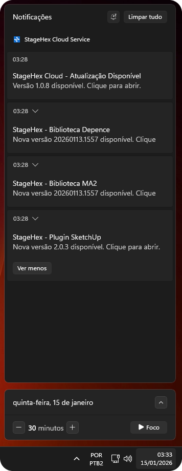
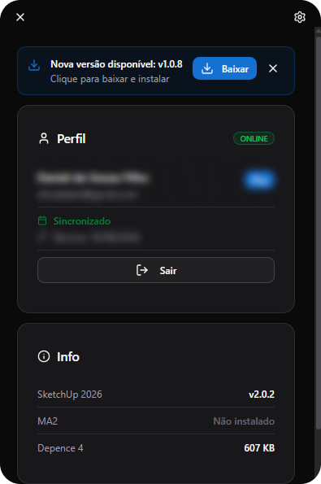
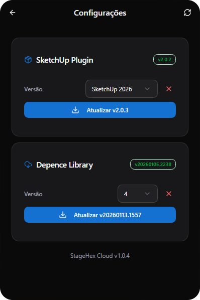

# Atualização

Atualizações de software, plugins e bibliotecas de assets são detectadas e aplicadas automaticamente enquanto o computador estiver conectado à internet.

***

## 1. Notificações de Atualização

Quando uma atualização estiver disponível, o StageHex Cloud notificará você diretamente através do sistema de notificações do Windows:

<figure><figcaption>
Notificações do Windows – Atualizações Disponíveis
</figcaption></figure>

As notificações podem incluir atualizações para:
- **StageHex Cloud**: Aplicativo principal
- **Plugin SketchUp**: Plugin StageHex para SketchUp
- **Biblioteca MA2**: Fixtures para grandMA2
- **Biblioteca Depence**: Assets para Depence

Clique na notificação para abrir o StageHex Cloud e iniciar a atualização.

***

## 2. Banner de Atualização

Ao abrir o StageHex Cloud com uma atualização pendente, um banner será exibido no topo da tela:

<figure><figcaption>
Banner de Atualização – StageHex Cloud
</figcaption></figure>

Clique no botão **Baixar** para iniciar o download e instalação da nova versão.


O StageHex Cloud será reiniciado automaticamente após a instalação da atualização.


***

## 3. Configurações e Atualizações Individuais

Na tela de **Configurações**, você pode gerenciar e atualizar componentes individualmente:

<figure><figcaption>
Configurações – Gerenciamento de Componentes
</figcaption></figure>

Para cada componente, você pode:
- Ver a **versão atual** instalada
- Selecionar a **versão do software** correspondente (ex: SketchUp 2026)
- Clicar em **Atualizar** para baixar a versão mais recente


Certifique-se de fechar o SketchUp antes de atualizar o plugin para evitar conflitos.


***

## Componentes Atualizáveis

| Componente | Descrição | Disponibilidade |
|------------|-----------|-----------------|
| **SketchUp Plugin** | Plugin StageHex para SketchUp | Todos os planos |
| **MA2 Library** | Biblioteca de fixtures para grandMA2 | Basic e Pro |
| **Depence Library** | Assets para Depence | Somente Pro |


A disponibilidade de bibliotecas varia conforme o plano contratado. Consulte a página de [Planos](../../visao-geral/planos/README.md) para mais detalhes.

