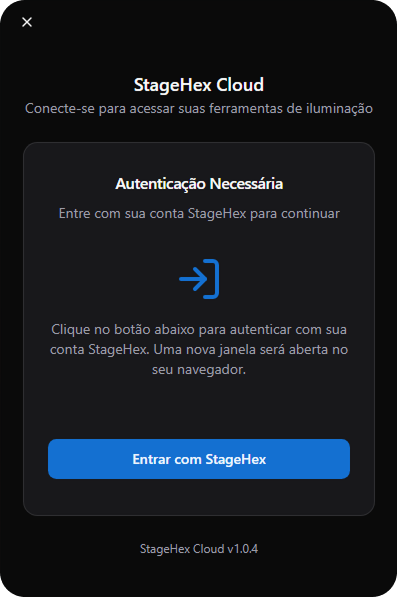
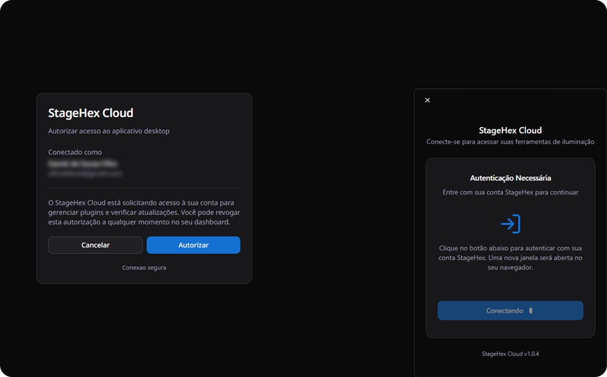

# Autorizando

Após instalar o StageHex Cloud, é necessário autenticar sua conta para acessar as ferramentas e bibliotecas.

***

## 1. Autenticação Necessária

Ao abrir o StageHex Cloud pela primeira vez (ou após deslogar), você verá a tela de autenticação:

<figure><figcaption>
Tela de Autenticação – StageHex Cloud
</figcaption></figure>

Clique no botão **Entrar com StageHex** para iniciar o processo de autorização.


Uma nova janela será aberta no seu navegador padrão para realizar a autenticação.


***

## 2. Autorizar Acesso

No navegador, você verá uma solicitação de autorização da StageHex Cloud:

<figure><figcaption>
Autorização – Conexão entre Navegador e StageHex Cloud
</figcaption></figure>

O popup exibirá:
- **Conta conectada**: Confirmação do usuário logado
- **Permissões solicitadas**: O StageHex Cloud solicita acesso para gerenciar plugins e verificar atualizações

Clique em **Autorizar** para conceder as permissões necessárias.


Você pode revogar esta autorização a qualquer momento através do seu dashboard no portal StageHex.


***

## 3. Conexão Estabelecida

Após autorizar, o StageHex Cloud será conectado automaticamente à sua conta. Você verá o status **Conectando...** enquanto a sincronização é realizada.

Quando a conexão for estabelecida com sucesso:
- O aplicativo exibirá seu perfil e status **ONLINE**
- Suas bibliotecas e plugins estarão disponíveis conforme seu plano
- A sincronização de dados será feita automaticamente


A autorização é vinculada ao dispositivo. Se você usar outro computador, será necessário repetir este processo.

