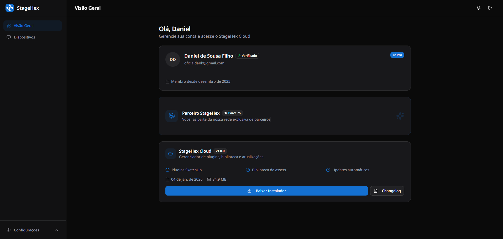

# Instalação

Conecte-se à [sua conta StageHex](https://www.stagehex.com) para acessar a página de download do StageHex Cloud e obter o instalador mais recente do software.

<figure><figcaption>
Minha Conta – Página de Download
</figcaption></figure>

O instalador irá baixar e instalar automaticamente a versão mais recente disponível do StageHex Cloud no seu sistema.


Certifique-se de que sua conta StageHex possui uma assinatura ativa ANTES de iniciar o download.\
Caso contrário, o instalador não será disponibilizado.



Importante:\
1\. Uma conexão ativa com a internet é obrigatória durante todo o processo de instalação.\
2\. É necessário possuir o SketchUp 2025 ou superior para utilizar os plugins StageHex.

