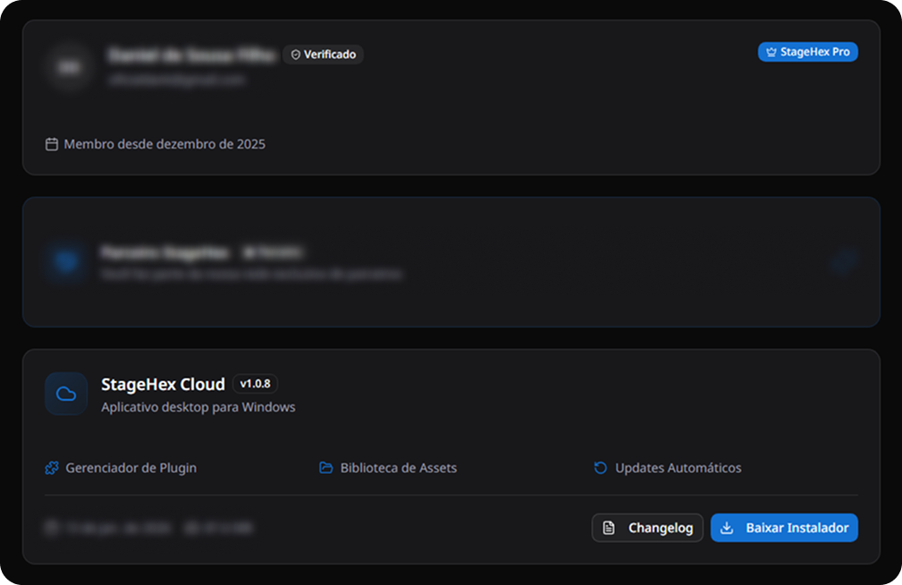
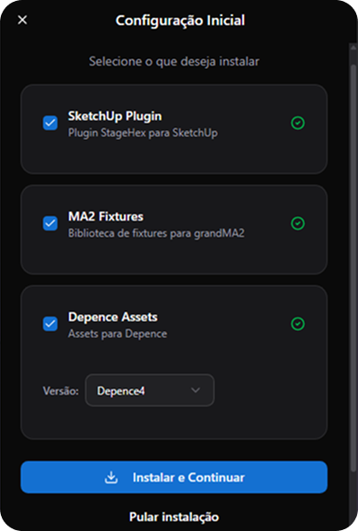
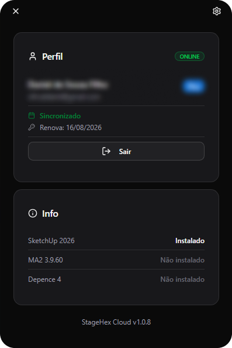
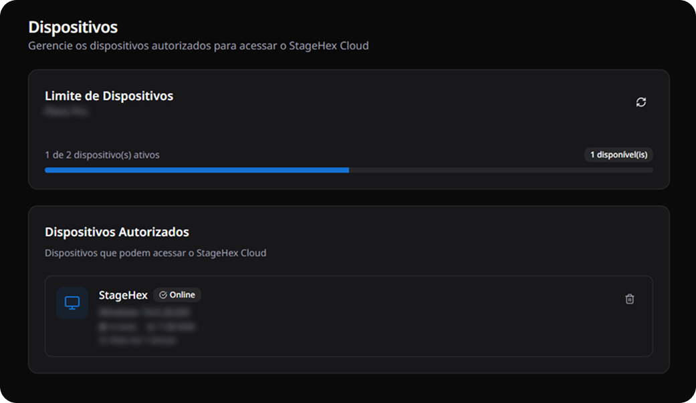

# Instalação

Este guia explica como baixar e instalar o StageHex Cloud no seu computador.

***

## 1. Baixar o Instalador

Conecte-se à [sua conta StageHex](https://www.stagehex.com) para acessar a página de download.

<figure><figcaption>
Página de Download – Minha Conta StageHex
</figcaption></figure>

Na seção **StageHex Cloud**, clique no botão **Baixar Instalador** para obter a versão mais recente.


Certifique-se de que sua conta StageHex possui uma **assinatura ativa** antes de iniciar o download.


***

## 2. Executar o Instalador

Após o download, execute o instalador. O processo é automático e instalará a versão mais recente do StageHex Cloud no seu sistema.


**Requisitos importantes:**
- Conexão com a internet durante todo o processo de instalação
- SketchUp 2025 ou superior instalado no computador


***

## 3. Configuração Inicial

Na primeira execução, você verá a tela de **Configuração Inicial**. Selecione os componentes que deseja instalar:

<figure><figcaption>
Configuração Inicial – Seleção de Componentes
</figcaption></figure>

| Componente | Descrição | Disponibilidade |
|------------|-----------|-----------------|
| **SketchUp Plugin** | Plugin StageHex para SketchUp | Todos os planos |
| **MA2 Fixtures** | Biblioteca de fixtures para grandMA2 | Basic e Pro |
| **Depence Assets** | Assets para Depence | Somente Pro |


Alguns componentes podem não estar disponíveis dependendo do seu plano. Consulte a página de [Planos](../../visao-geral/planos.md) para mais detalhes.


Clique em **Instalar e Continuar** para prosseguir, ou **Pular instalação** se desejar configurar depois.

***

## 4. Dashboard Principal

Após a configuração, você terá acesso ao dashboard principal do StageHex Cloud:

<figure><figcaption>
Dashboard – StageHex Cloud
</figcaption></figure>

### Seção Perfil
- **Status**: Indica se você está online e sincronizado
- **Renova**: Data de renovação da sua assinatura
- **Sair**: Encerra a sessão e desloga da conta

### Seção Info
Exibe o status de instalação dos componentes:
- **Instalado**: Componente instalado e pronto para uso
- **Não instalado**: Componente disponível mas não instalado

***

## 5. Gerenciamento de Dispositivos

O StageHex Cloud possui um limite de dispositivos autorizados por conta, que varia conforme o plano contratado.

<figure><figcaption>
Gerenciamento de Dispositivos – Portal StageHex
</figcaption></figure>

Na seção **Dispositivos** do portal StageHex, você pode:
- Visualizar o **limite de dispositivos** do seu plano
- Ver a lista de **dispositivos autorizados**
- **Remover dispositivos** que não são mais utilizados


Se você atingir o limite de dispositivos, será necessário remover um dispositivo antigo antes de autorizar um novo.

