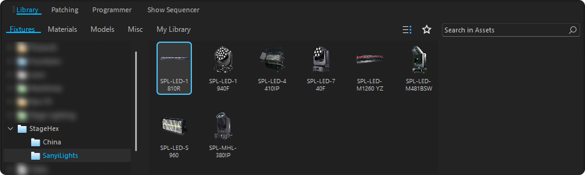

# Depence

Integração do StageHex com o Depence, incluindo instalação automática da biblioteca de fixtures StageHex e importação via MVR.

***

## Biblioteca StageHex para Depence

A **StageHex Cloud** instala automaticamente a biblioteca de fixtures **StageHex** no Depence.

### Detecção Automática

O sistema detecta automaticamente instalações do Depence:

- **Caminho base**: `C:\ProgramData\Syncronorm`
- **Versões**: Detecta Depence2 e Depence4
- **Seleção**: Usa a versão mais recente por padrão (Depence4 > Depence2)

### Instalação Automática

A biblioteca de fixtures StageHex é instalada em:

```
C:\ProgramData\Syncronorm\Depence4\FactoryLibrary\asset_files\
```

Os fixtures ficam organizados por fabricante dentro da estrutura do Depence.


A instalação é feita automaticamente pela StageHex Cloud. Basta manter o aplicativo aberto para receber atualizações da biblioteca.


***

## Acessando os Fixtures StageHex

### Localização no Depence

<figure><figcaption><p>Fixtures da biblioteca StageHex no Depence (Fixtures/StageHex/Manufacturer)</p></figcaption></figure>

**Navegação:**

1. No Depence, abra a aba **Fixtures**
2. Navegue para **StageHex** na lista de fabricantes
3. Expanda para ver os fixtures disponíveis


Os fixtures são instalados automaticamente pela StageHex Cloud e atualizados regularmente.


***

## Exportando do SketchUp

Para exportar seu projeto do StageHex para o Depence:

1. Abra o **Gerenciador de Interface** (primeiro botão da Main Tools)
2. Vá para a aba **Exportar**
3. Selecione **MVR**
4. Exporte o arquivo `.mvr`

O Depence importa projetos através do formato MVR padrão.

***

## Importando no Depence

### Importando Arquivo MVR

<figure><figcaption><p>Matching Type com fixtures da biblioteca StageHex</p></figcaption></figure>

**Passos:**

1. No Depence, vá para **File → Import → MVR**
2. Selecione o arquivo `.mvr` exportado do StageHex
3. Na tela de **Matching Type**, associe os fixtures
4. Selecione os fixtures correspondentes da biblioteca StageHex
5. Confirme a importação

### Matching Type

Durante a importação, o Depence permite associar os fixtures do MVR com os da biblioteca StageHex:

<table>
<thead>
<tr>
<th>Coluna</th>
<th>Descrição</th>
</tr>
</thead>
<tbody>
<tr>
<td><strong>MVR Fixture</strong></td>
<td>Nome do fixture no arquivo MVR</td>
</tr>
<tr>
<td><strong>Library Match</strong></td>
<td>Fixture correspondente na biblioteca StageHex</td>
</tr>
<tr>
<td><strong>Status</strong></td>
<td>Indica se o match foi encontrado</td>
</tr>
</tbody>
</table>


Os fixtures StageHex são automaticamente reconhecidos quando a biblioteca está instalada pela StageHex Cloud.


***

## Configurações

### Versões Suportadas

<table>
<thead>
<tr>
<th>Software</th>
<th width="150" align="center">Suportado</th>
</tr>
</thead>
<tbody>
<tr>
<td><strong>Depence2</strong></td>
<td align="center">✔</td>
</tr>
<tr>
<td><strong>Depence4</strong></td>
<td align="center">✔</td>
</tr>
</tbody>
</table>

### Arquivos Instalados

A StageHex Cloud gerencia os seguintes arquivos no Depence:

<table>
<thead>
<tr>
<th>Arquivo</th>
<th>Descrição</th>
</tr>
</thead>
<tbody>
<tr>
<td><strong>asset_library.dat</strong></td>
<td>Banco de dados da biblioteca</td>
</tr>
<tr>
<td><strong>asset_files/</strong></td>
<td>Pasta com arquivos dos fixtures StageHex</td>
</tr>
</tbody>
</table>

### Atualizações Automáticas

A StageHex Cloud gerencia automaticamente:

- **Detecção de versão**: Identifica Depence2 e Depence4 instalados
- **Instalação da biblioteca**: Instala os fixtures StageHex na FactoryLibrary
- **Atualização**: Sincroniza novos fixtures quando disponíveis
- **Configuração de caminhos**: Ajusta paths conforme versão selecionada


Não modifique manualmente os arquivos da biblioteca StageHex na pasta FactoryLibrary. Use a StageHex Cloud para atualizações.

