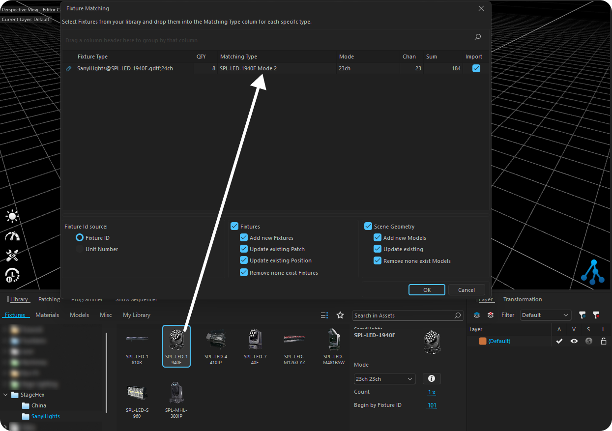

# Importando no Depence

O Depence importa projetos do StageHex através do formato MVR.

***

## Exportando do SketchUp

Para exportar seu projeto do StageHex para o Depence:

1. Abra o **Gerenciador de Interface** (primeiro botão da Main Tools)
2. Vá para a aba **Exportar**
3. Selecione **MVR**
4. Exporte o arquivo `.mvr`

***

## Importando Arquivo MVR

<figure><figcaption>
Matching Type com fixtures da biblioteca StageHex
</figcaption></figure>

**Passos:**

1. No Depence, vá para **File → Import → MVR**
2. Selecione o arquivo `.mvr` exportado do StageHex
3. Na tela de **Matching Type**, associe os fixtures
4. Selecione os fixtures correspondentes da biblioteca StageHex
5. Confirme a importação

***

## Matching Type

Durante a importação, o Depence permite associar os fixtures do MVR com os da biblioteca StageHex:

<table>
<thead>
<tr>
<th width="180">Coluna</th>
<th>Descrição</th>
</tr>
</thead>
<tbody>
<tr>
<td><strong>MVR Fixture</strong></td>
<td>Nome do fixture no arquivo MVR</td>
</tr>
<tr>
<td><strong>Library Match</strong></td>
<td>Fixture correspondente na biblioteca StageHex</td>
</tr>
<tr>
<td><strong>Status</strong></td>
<td>Indica se o match foi encontrado</td>
</tr>
</tbody>
</table>


Os fixtures StageHex são automaticamente reconhecidos quando a biblioteca está instalada pela StageHex Cloud.

