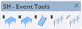

# Event Tools

Ferramentas para criação de estruturas de eventos: plataformas, escadas e guarda-corpos.

<figure><figcaption>
SH - Event Tools
</figcaption></figure>

***

## Lista de Ferramentas

<table>
<thead>
<tr>
<th width="50" align="center">#</th>
<th>Ferramenta</th>
<th>Descrição</th>
</tr>
</thead>
<tbody>
<tr>
<td align="center">1</td>
<td><strong>Inserir Plataforma</strong></td>
<td>Insere uma plataforma (deck) no modelo</td>
</tr>
<tr>
<td align="center">2</td>
<td><strong>Desenhar Plataforma</strong></td>
<td>Desenha plataformas interativamente</td>
</tr>
<tr>
<td align="center">3</td>
<td><strong>Inserir Escadas</strong></td>
<td>Insere escadas de acesso às plataformas</td>
</tr>
<tr>
<td align="center">4</td>
<td><strong>Inserir Guarda-Corpo</strong></td>
<td>Insere guarda-corpo em posição específica</td>
</tr>
<tr>
<td align="center">5</td>
<td><strong>Desenhar Guarda-Corpo</strong></td>
<td>Desenha guarda-corpo ao longo de um caminho</td>
</tr>
</tbody>
</table>

***

## Detalhes das Ferramentas

### Inserir Plataforma

Insere uma plataforma (deck) de eventos no modelo. Permite configurar:

* Dimensões da plataforma
* Altura das pernas
* Tipo de estrutura

### Desenhar Plataforma

Modo de desenho interativo para criar plataformas:

1. Clique no primeiro ponto
2. Arraste para definir a área
3. Clique para confirmar

### Inserir Escadas

Insere escadas de acesso para plataformas de eventos:

* Escadas retas
* Configuração de degraus
* Altura automática baseada na plataforma

### Inserir Guarda-Corpo

Insere um módulo de guarda-corpo em posição específica:

* Guarda-corpo padrão de eventos
* Conexão com plataformas

### Desenhar Guarda-Corpo

Desenha guarda-corpo ao longo de um caminho selecionado:

1. Selecione as arestas do caminho
2. Ative a ferramenta
3. Os guarda-corpos são criados automaticamente

***

## Disponibilidade por Plano

<table>
<thead>
<tr>
<th>Ferramenta</th>
<th width="100" align="center">Trial</th>
<th width="100" align="center">Basic</th>
<th width="100" align="center">Pro</th>
</tr>
</thead>
<tbody>
<tr>
<td>Inserir Plataforma</td>
<td align="center">✔</td>
<td align="center">✔</td>
<td align="center">✔</td>
</tr>
<tr>
<td>Desenhar Plataforma</td>
<td align="center">✔</td>
<td align="center">✔</td>
<td align="center">✔</td>
</tr>
<tr>
<td>Inserir Escadas</td>
<td align="center">✔</td>
<td align="center">✔</td>
<td align="center">✔</td>
</tr>
<tr>
<td>Inserir Guarda-Corpo</td>
<td align="center">✔</td>
<td align="center">✔</td>
<td align="center">✔</td>
</tr>
<tr>
<td>Desenhar Guarda-Corpo</td>
<td align="center">✔</td>
<td align="center">✔</td>
<td align="center">✔</td>
</tr>
</tbody>
</table>


Todas as ferramentas de Event Tools estão disponíveis em todos os planos.

