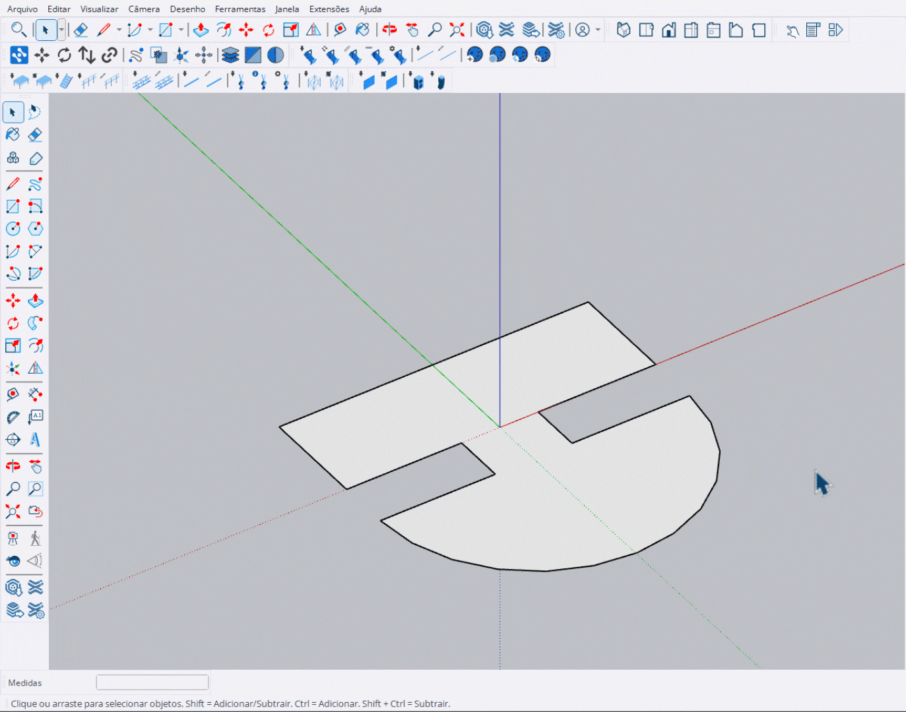

# Desenhar Deck (Draw Deck)

Ferramenta para desenhar plataformas de deck interativamente através de retângulos.

<figure><figcaption>
Desenhando plataformas com retângulos
</figcaption></figure>

***

## Como Usar

### Modo Desenho Livre

1. Ative a ferramenta **Desenhar Deck**
2. **1º clique**: Define o ponto inicial do retângulo
3. **Arraste** para definir a área
4. **2º clique**: Finaliza o retângulo
5. Repita para criar múltiplas áreas
6. Pressione **Enter** para aplicar todos os decks


Você pode desenhar **múltiplos retângulos** antes de aplicar. Todos serão criados de uma vez.


### Modo VCB (Tamanho Fixo)

1. Digite no VCB: `largura;profundidade` (ex: `4;6` para 4m x 6m)
2. Mova o mouse para posicionar a área
3. **Clique** para confirmar a posição
4. Pressione **Enter** para aplicar

***

## Controles

<table>
<thead>
<tr>
<th width="180">Tecla</th>
<th>Ação</th>
</tr>
</thead>
<tbody>
<tr>
<td><strong>Enter</strong></td>
<td>Aplicar todos os decks</td>
</tr>
<tr>
<td><strong>Esc</strong></td>
<td>Cancelar retângulo atual / Sair</td>
</tr>
<tr>
<td><strong>Ctrl</strong></td>
<td>Girar direção 90°</td>
</tr>
<tr>
<td><strong>↑</strong></td>
<td>Aumentar altura</td>
</tr>
<tr>
<td><strong>↓</strong></td>
<td>Diminuir altura</td>
</tr>
</tbody>
</table>

***

## Entrada VCB

<table>
<thead>
<tr>
<th width="180">Formato</th>
<th>Exemplo</th>
<th>Resultado</th>
</tr>
</thead>
<tbody>
<tr>
<td><code>largura;profund</code></td>
<td><code>4;6</code></td>
<td>Área de 4m x 6m</td>
</tr>
<tr>
<td><code>largura;profund</code></td>
<td><code>8;4</code></td>
<td>Área de 8m x 4m</td>
</tr>
</tbody>
</table>


O modo VCB permite criar áreas de tamanho exato. Use **Esc** para voltar ao modo de desenho livre.


***

## Painel de Informações

Durante o uso, um painel exibe:

- **Modo**: Livre ou VCB (com dimensões)
- **Altura**: Altura atual dos decks (cm)
- **Direção**: Rotação dos módulos (0°, 90°, 180°, 270°)
- **Decks**: Total de módulos no preview

***

## Grid e Snap

- Todos os pontos são ajustados ao **grid de 1 metro**
- O sistema calcula automaticamente a quantidade ideal de módulos
- Prioriza módulos **2x1** e completa com **1x1**
