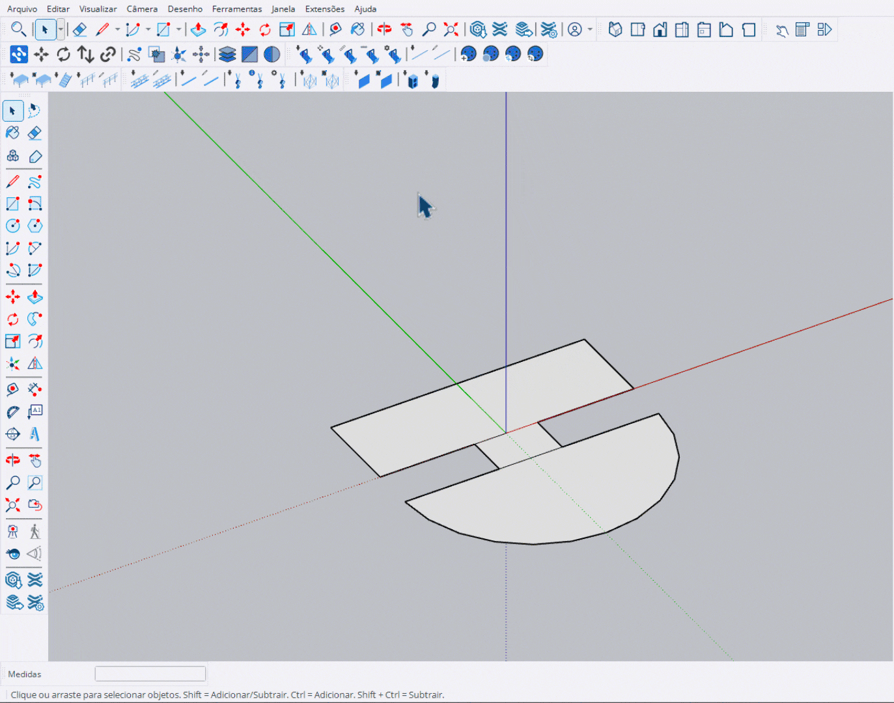

# Posicionar Deck (Place Deck)

Ferramenta para preencher automaticamente faces selecionadas com módulos de deck.

<figure><figcaption>
Preenchimento automático de faces com decks
</figcaption></figure>

***

## Como Usar

1. **Selecione** uma ou mais faces horizontais (pisos)
2. Ative a ferramenta **Posicionar Deck**
3. Ajuste **altura** e **direção** conforme necessário
4. Pressione **Enter** para aplicar


Apenas **faces horizontais** (com normal apontando para cima ou para baixo) são aceitas.


***

## Controles

<table>
<thead>
<tr>
<th width="180">Tecla</th>
<th>Ação</th>
</tr>
</thead>
<tbody>
<tr>
<td><strong>Enter</strong></td>
<td>Aplicar decks</td>
</tr>
<tr>
<td><strong>Esc</strong></td>
<td>Cancelar e sair</td>
</tr>
<tr>
<td><strong>Ctrl</strong></td>
<td>Girar direção 90°</td>
</tr>
<tr>
<td><strong>↑</strong></td>
<td>Aumentar altura</td>
</tr>
<tr>
<td><strong>↓</strong></td>
<td>Diminuir altura</td>
</tr>
</tbody>
</table>

***

## Painel de Informações

Durante o uso, um painel exibe:

- **Faces**: Quantidade de faces selecionadas
- **Altura**: Altura atual dos decks (cm)
- **Direção**: Rotação dos módulos (0°, 90°, 180°, 270°)
- **Decks**: Total de módulos que serão criados

***

## Preenchimento Automático

O algoritmo preenche a área de forma otimizada:

1. Prioriza módulos **2x1** (mais eficientes)
2. Completa espaços restantes com módulos **1x1**
3. Respeita os limites da face selecionada
4. Alinha ao grid de 1 metro
