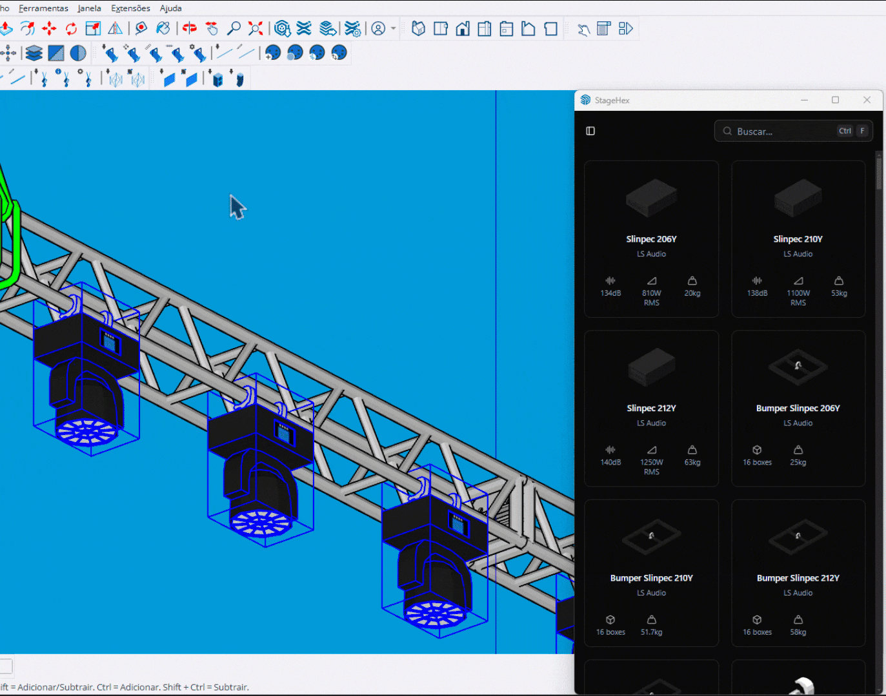

# Configurações

Ferramenta para ajustar propriedades dos fixtures selecionados (Pan/Tilt e Clamps).

<figure><figcaption>
Ajustando configurações dos fixtures
</figcaption></figure>

***

## Como Usar

1. **Selecione** um ou mais fixtures
2. Ative a ferramenta **Configurações**
3. O diálogo HTML é aberto automaticamente
4. Ajuste os valores desejados
5. Clique em **Apply** para aplicar


O diálogo monitora mudanças na seleção e atualiza automaticamente.


***

## Pan e Tilt

Controle a orientação do feixe de luz:

<table>
<thead>
<tr>
<th width="150">Parâmetro</th>
<th>Descrição</th>
</tr>
</thead>
<tbody>
<tr>
<td><strong>Pan</strong></td>
<td>Rotação horizontal (em graus)</td>
</tr>
<tr>
<td><strong>Tilt</strong></td>
<td>Rotação vertical (em graus)</td>
</tr>
</tbody>
</table>

***

## Clamps

Configure a fixação do fixture:

<table>
<thead>
<tr>
<th width="150">Opção</th>
<th>Descrição</th>
</tr>
</thead>
<tbody>
<tr>
<td><strong>No Clamp</strong></td>
<td>Remove o clamp do fixture</td>
</tr>
<tr>
<td><strong>Modelo</strong></td>
<td>Seleciona um clamp compatível</td>
</tr>
</tbody>
</table>


A lista de clamps compatíveis é definida nos metadados do fixture.


***

## Controles

<table>
<thead>
<tr>
<th width="180">Tecla</th>
<th>Ação</th>
</tr>
</thead>
<tbody>
<tr>
<td><strong>Esc</strong></td>
<td>Fechar diálogo e sair</td>
</tr>
</tbody>
</table>

***

## Seleção Dinâmica

A ferramenta observa mudanças na seleção:

- **Adicionar fixtures**: Selecione mais enquanto o diálogo está aberto
- **Remover fixtures**: Desselecione para remover da lista
- **Atualização automática**: O diálogo reflete as mudanças imediatamente

***

## Operações em Lote

Quando múltiplos fixtures são selecionados:

- As alterações são aplicadas a **todos** os fixtures
- Uma única operação de undo reverte todas as mudanças
- O progresso é mostrado durante a aplicação

***

## Fixtures Wrapped

A ferramenta detecta automaticamente:

- **Fixture simples**: ComponentInstance direto
- **Fixture com clamp**: Group contendo fixture e clamp

O sistema gerencia automaticamente o wrapper (group) ao adicionar/remover clamps.
