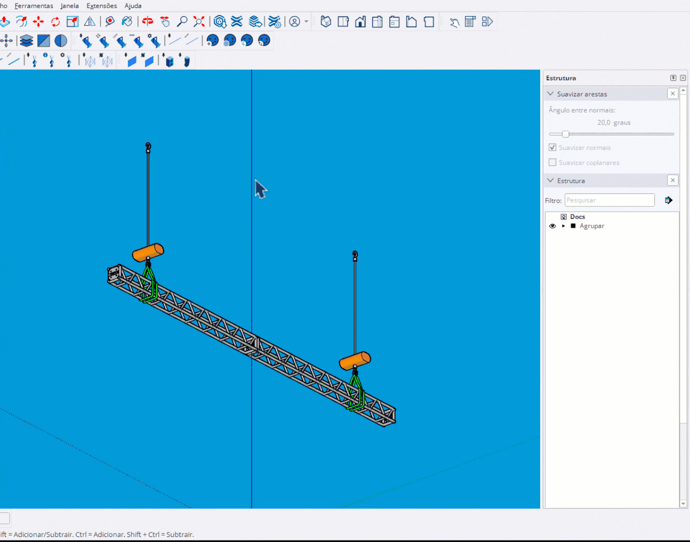

# Distribuir no Truss

Ferramenta avançada para distribuir fixtures em faces de truss com configuração de clamps.

<figure><figcaption>
Distribuindo fixtures em truss com clamps
</figcaption></figure>

***

## Como Usar

### Workflow

1. Clique em **Add Set** para iniciar seleção
2. **1º clique**: Selecione uma **face** do truss
3. **2º clique**: Selecione uma **aresta** para definir o caminho
4. Configure o fixture e clamp no diálogo
5. Repita para criar múltiplos sets
6. Clique em **Place All** para posicionar


O sistema detecta automaticamente gaps (conexões) no truss e evita posicionar fixtures sobre eles.


***

## Controles

<table>
<thead>
<tr>
<th width="180">Tecla</th>
<th>Ação</th>
</tr>
</thead>
<tbody>
<tr>
<td><strong>Botão direito</strong></td>
<td>Voltar para seleção de face</td>
</tr>
<tr>
<td><strong>Esc</strong></td>
<td>Sair da ferramenta (mantém sets criados)</td>
</tr>
</tbody>
</table>

***

## Configuração por Set

Cada set pode ter configuração independente:

<table>
<thead>
<tr>
<th width="150">Opção</th>
<th>Descrição</th>
</tr>
</thead>
<tbody>
<tr>
<td><strong>Fixture</strong></td>
<td>Modelo do equipamento</td>
</tr>
<tr>
<td><strong>Clamp</strong></td>
<td>Modelo do clamp (garra)</td>
</tr>
<tr>
<td><strong>Quantidade</strong></td>
<td>Número de fixtures no set</td>
</tr>
<tr>
<td><strong>Modo Clamp</strong></td>
<td>Single ou Double clamp</td>
</tr>
</tbody>
</table>

***

## Modos de Clamp

<table>
<thead>
<tr>
<th width="150">Modo</th>
<th>Comportamento</th>
</tr>
</thead>
<tbody>
<tr>
<td><strong>Single</strong></td>
<td>Um clamp no centro do fixture</td>
</tr>
<tr>
<td><strong>Double</strong></td>
<td>Dois clamps com espaçamento configurável</td>
</tr>
</tbody>
</table>

***

## Loop Pattern

A ferramenta suporta **loop pattern** para múltiplos fixtures:

- Configure diferentes fixtures no mesmo set
- Eles serão distribuídos em sequência (A, B, A, B, ...)
- Cada fixture pode ter seu próprio clamp

***

## Detecção de Gaps

O sistema detecta automaticamente:

- **Conexões de truss**: Gaps onde trusses se conectam
- **Espaçamento inteligente**: Fixtures são posicionados evitando gaps
- **Indicadores visuais**: X vermelho marca posições de gap

***

## Preview Visual

Durante a configuração:

- **Faces coplanares**: Destacadas em azul
- **Caminho**: Linha indicando o percurso
- **Fixtures**: Caixas coloridas por tipo
- **Clamps**: Caixas amarelas nas posições de fixação
