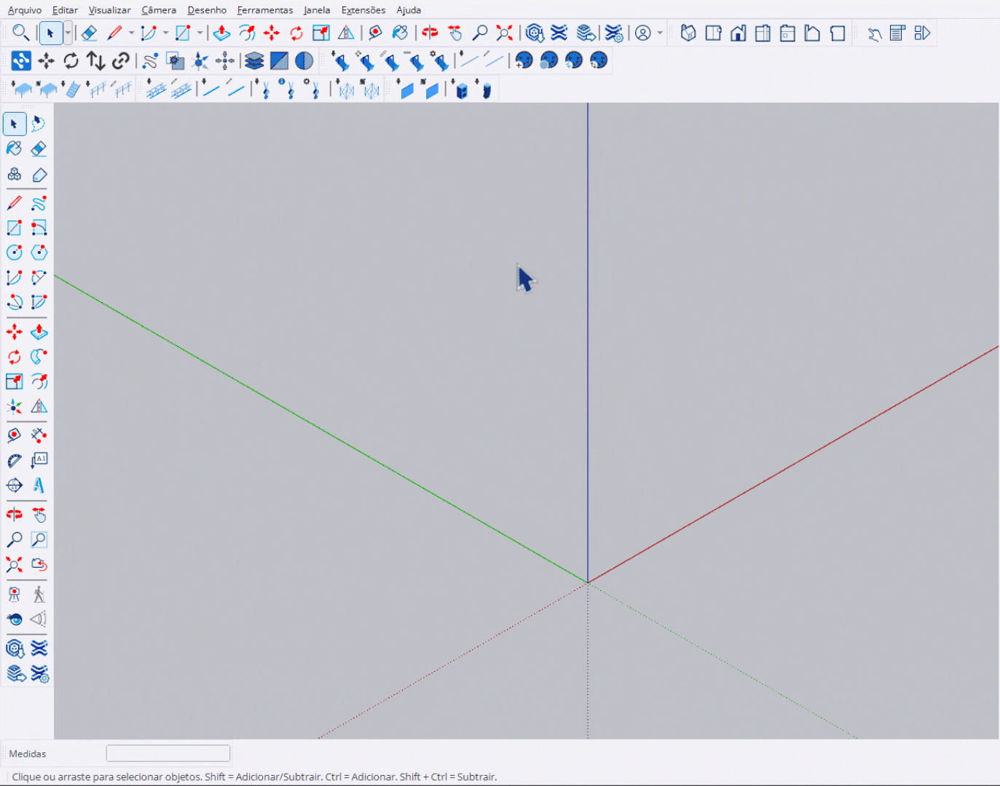
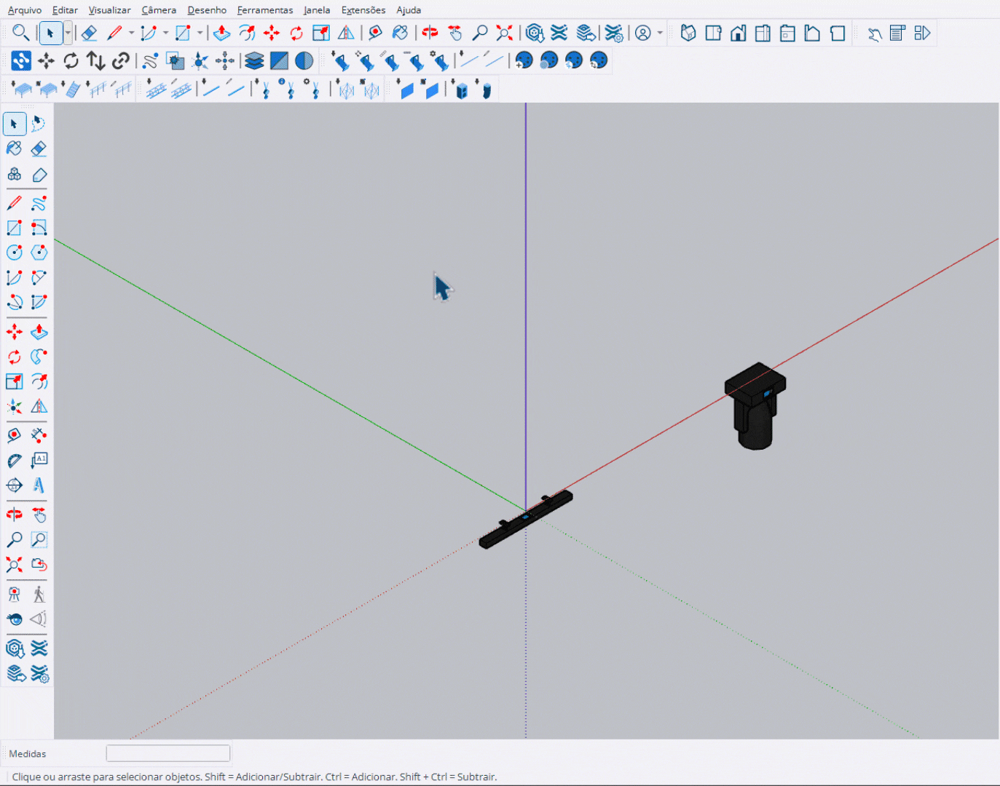

# Inserir Equipamento

Ferramenta para posicionar fixtures de iluminação individualmente.

<figure><figcaption>
Posicionando fixtures no modelo
</figcaption></figure>

***

## Como Usar

1. Ative a ferramenta **Inserir Equipamento**
2. Selecione o modelo de fixture no **HUD**
3. Mova o cursor sobre a superfície desejada
4. **Clique** para posicionar o fixture
5. Continue clicando para posicionar múltiplos fixtures


O fixture é automaticamente **orientado** de acordo com a face onde é posicionado.


***

## Controles

<table>
<thead>
<tr>
<th width="180">Tecla</th>
<th>Ação</th>
</tr>
</thead>
<tbody>
<tr>
<td><strong>Ctrl</strong></td>
<td>Modo Pick - seleciona fixture existente como modelo</td>
</tr>
<tr>
<td><strong>Enter</strong></td>
<td>Finalizar e sair</td>
</tr>
<tr>
<td><strong>Esc</strong></td>
<td>Cancelar / Sair</td>
</tr>
</tbody>
</table>

***

## Função Pick

<figure><figcaption>
Selecionando fixture existente como referência
</figcaption></figure>

Pressione **Ctrl** para ativar o modo Pick:

1. Segure **Ctrl** para entrar no modo Pick
2. Clique em um fixture existente
3. A ferramenta passa a usar o mesmo modelo


Apenas fixtures StageHex válidos podem ser selecionados no modo Pick.


***

## Orientação Automática

A ferramenta detecta automaticamente:

- **Face da superfície**: O fixture é orientado perpendicular à face
- **Snaps**: Utiliza os snaps do SketchUp para posicionamento preciso
- **Preview**: Mostra a caixa delimitadora antes de posicionar

***

## VCB (Caixa de Valor)

O contador de fixtures colocados é exibido no VCB:

| Campo | Valor |
|-------|-------|
| **Label** | Colocados |
| **Valor** | Número de fixtures posicionados na sessão |
