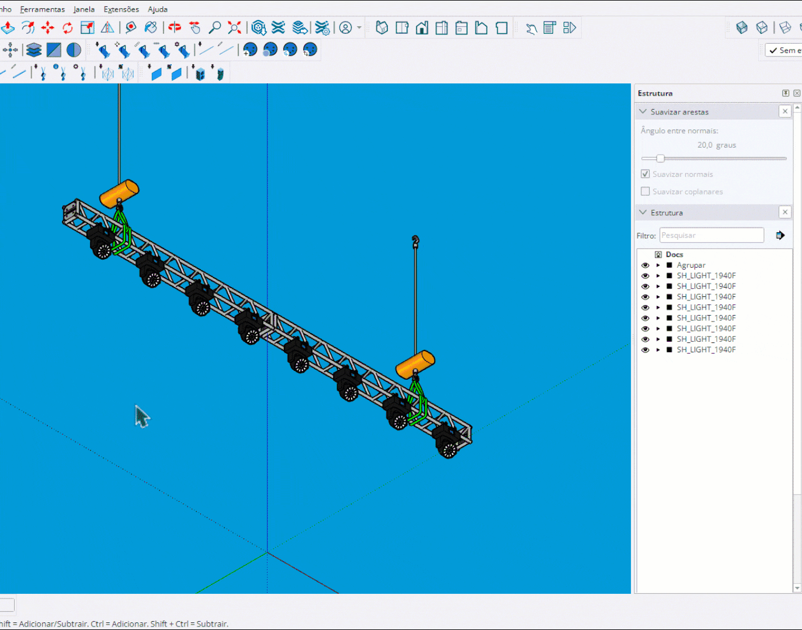

# Patch Automático

Ferramenta de patching inteligente que organiza fixtures por Grupo, Tipo ou Tag.

<figure><figcaption>
Patching inteligente por grupos ou tipos
</figcaption></figure>

***

## Como Usar

1. **Opcionalmente** selecione fixtures específicos
2. Ative a ferramenta **Patch Automático**
3. Escolha o método: By Group, By Type ou By Tag
4. Configure cada grupo no diálogo
5. **Enter** ou **Clique** para aplicar


Se nenhum fixture estiver selecionado, a ferramenta detecta todos os fixtures da cena.


***

## Controles

<table>
<thead>
<tr>
<th width="180">Tecla</th>
<th>Ação</th>
</tr>
</thead>
<tbody>
<tr>
<td><strong>Tab</strong></td>
<td>Mostrar/ocultar fixtures já patcheados</td>
</tr>
<tr>
<td><strong>Enter</strong></td>
<td>Aplicar patch</td>
</tr>
<tr>
<td><strong>Clique</strong></td>
<td>Aplicar patch</td>
</tr>
<tr>
<td><strong>Space</strong></td>
<td>Sair da ferramenta</td>
</tr>
<tr>
<td><strong>Esc</strong></td>
<td>Cancelar / Sair</td>
</tr>
</tbody>
</table>

***

## Métodos de Agrupamento

### By Group

Agrupa fixtures pela estrutura de grupos do SketchUp:

- Fixtures dentro do mesmo grupo ficam juntos
- Fixtures sem grupo vão para "No Group"
- Cada grupo pode ter configuração independente

### By Type

Agrupa fixtures pelo tipo (definição do componente):

- Todos os Moving Heads ficam juntos
- Todos os PAR ficam juntos
- Útil para separar diferentes categorias de fixtures

### By Tag

Agrupa fixtures pela Layer (Tag) do SketchUp:

- Fixtures na mesma layer ficam juntos
- Fixtures sem layer específica vão para "Untagged"
- Permite organização por função (FOH, Truss, Backlight, etc.)

***

## Configuração por Grupo

Cada grupo pode ter:

<table>
<thead>
<tr>
<th width="150">Parâmetro</th>
<th>Descrição</th>
</tr>
</thead>
<tbody>
<tr>
<td><strong>Universe</strong></td>
<td>Universo inicial do grupo</td>
</tr>
<tr>
<td><strong>Address</strong></td>
<td>Endereço DMX inicial</td>
</tr>
<tr>
<td><strong>Unit</strong></td>
<td>ID inicial</td>
</tr>
<tr>
<td><strong>Ordenação</strong></td>
<td>Primeira e segunda ordem de classificação</td>
</tr>
<tr>
<td><strong>DMX Mode</strong></td>
<td>Modo de canais para o grupo</td>
</tr>
</tbody>
</table>

***

## Preview Visual

O preview mostra:

- **Cores por grupo**: Cada grupo tem cor diferente
- **Caixas**: Indicam fixtures e sua ordem
- **Labels**: Universe.Address e Unit ID
- **Separação visual**: Grupos são claramente distintos

***

## Hierarquia de Grupos

O sistema analisa a hierarquia do SketchUp:

- **Grupo organizacional**: Primeiro grupo que contém o fixture
- **Clamp wrapper**: Ignorado (considerado parte do fixture)
- **Profundidade**: Detecta fixtures aninhados em múltiplos níveis

***

## Sobrescrita

Ao aplicar, se existirem fixtures já patcheados:

- Um diálogo de confirmação é exibido
- Mostra quantos fixtures serão sobrescritos
- Você pode cancelar ou confirmar a sobrescrita

***

## Resultado

Após aplicar, um resumo é exibido:

- **Method**: Método usado (Group/Type/Tag)
- **Groups/Types**: Número de grupos/tipos
- **Total Fixtures**: Total de fixtures patcheados
- **Patched**: Novos patches aplicados
- **Overwritten**: Patches sobrescritos
