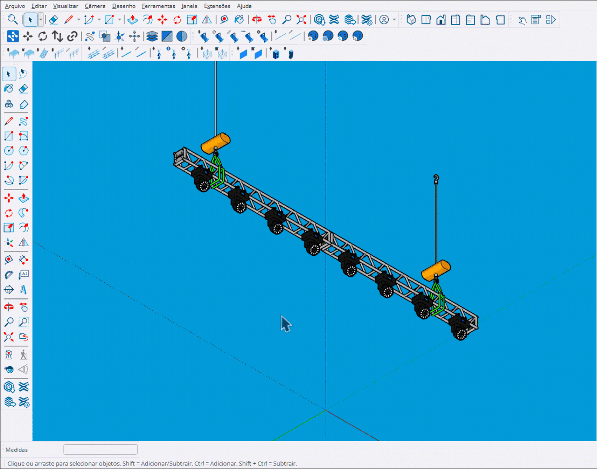

# Trocar Modo

Ferramenta para alterar o modo DMX (quantidade de canais) dos fixtures.

<figure><figcaption>
Alterando modo DMX dos fixtures
</figcaption></figure>

***

## Como Usar

### Modo Seleção (com fixtures selecionados)

1. **Selecione** um ou mais fixtures
2. Ative a ferramenta **Trocar Modo**
3. O diálogo de seleção de modo aparece
4. Escolha o novo modo para cada tipo de fixture
5. Clique em **OK** para aplicar

### Modo Clique (sem seleção)

1. Ative a ferramenta **Trocar Modo**
2. Passe o mouse sobre um fixture
3. **Clique** para abrir o diálogo de modo
4. Escolha o novo modo
5. Continue alterando outros fixtures


Use **Ctrl+Click** para selecionar automaticamente todas as instâncias do mesmo fixture.


***

## Controles

<table>
<thead>
<tr>
<th width="180">Tecla</th>
<th>Ação</th>
</tr>
</thead>
<tbody>
<tr>
<td><strong>Ctrl</strong></td>
<td>Preview de todas as instâncias do mesmo tipo</td>
</tr>
<tr>
<td><strong>Ctrl+Click</strong></td>
<td>Seleciona todas as instâncias e abre diálogo</td>
</tr>
<tr>
<td><strong>Tab</strong></td>
<td>Mostrar/ocultar fixtures patcheados</td>
</tr>
<tr>
<td><strong>Space</strong></td>
<td>Sair da ferramenta</td>
</tr>
<tr>
<td><strong>Esc</strong></td>
<td>Cancelar / Sair</td>
</tr>
</tbody>
</table>

***

## Modos DMX

Cada fixture pode ter múltiplos modos disponíveis:

<table>
<thead>
<tr>
<th width="150">Exemplo</th>
<th>Descrição</th>
</tr>
</thead>
<tbody>
<tr>
<td><strong>Basic (6ch)</strong></td>
<td>Modo básico com 6 canais</td>
</tr>
<tr>
<td><strong>Standard (12ch)</strong></td>
<td>Modo padrão com 12 canais</td>
</tr>
<tr>
<td><strong>Extended (18ch)</strong></td>
<td>Modo estendido com 18 canais</td>
</tr>
</tbody>
</table>


Os modos disponíveis são definidos nos metadados de cada fixture.


***

## Preview Visual

Durante o uso:

<table>
<thead>
<tr>
<th width="150">Cor</th>
<th>Significado</th>
</tr>
</thead>
<tbody>
<tr>
<td><strong>Azul (ativo)</strong></td>
<td>Fixture sob o cursor</td>
</tr>
<tr>
<td><strong>Azul (padrão)</strong></td>
<td>Instâncias do mesmo tipo (com Ctrl)</td>
</tr>
<tr>
<td><strong>Branco</strong></td>
<td>Outros fixtures patcheados</td>
</tr>
</tbody>
</table>

***

## Função Ctrl (Selecionar Iguais)

Ao pressionar Ctrl sobre um fixture:

1. **Preview**: Todas as instâncias do mesmo tipo são destacadas
2. **Contador**: Mostra "X instances" sobre o fixture
3. **Ctrl+Click**: Abre diálogo para alterar todas de uma vez

***

## Diálogo de Seleção

O diálogo mostra:

- **Nome do fixture**: Tipo e quantidade selecionada
- **Modo atual**: Modo e canais atuais
- **Lista de modos**: Todos os modos disponíveis
- **Canais**: Número de canais de cada modo

***

## Tipos Mistos

Quando diferentes tipos de fixtures são selecionados:

- Cada tipo aparece como uma linha no diálogo
- Cada tipo pode ter seu modo alterado independentemente
- A quantidade de cada tipo é exibida (ex: "MAC Aura (5x)")

***

## Resultado

Após aplicar:

- **Sucesso**: Mensagem com quantidade de fixtures atualizados
- **Novo modo**: Nome do modo aplicado
- **Erros**: Se houver, quantidade de falhas é informada
