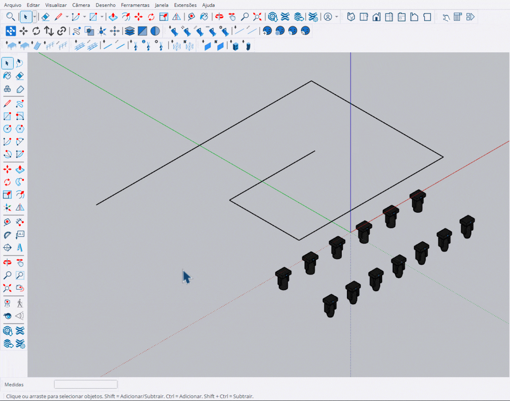

# Distribuir Objetos (Path Array)

Ferramenta para distribuir componentes ou grupos ao longo de um caminho (edges).

<figure><figcaption>
Distribuição de componentes ao longo de um caminho
</figcaption></figure>

***

## Como Usar

### Passo 1: Selecionar Componentes

1. Ative a ferramenta **Distribuir Objetos**
2. Clique nos componentes ou grupos que deseja distribuir
3. Pressione **Enter** para confirmar a seleção


Você pode selecionar múltiplos componentes diferentes (A, B, C). Eles serão distribuídos em ciclo ao longo do caminho (A, B, C, A, B, C...).


### Passo 2: Selecionar Caminho

1. Clique em uma **edge** (aresta) para definir o caminho
2. A ferramenta detecta automaticamente edges conectadas (soldadas)


As edges precisam estar conectadas (soldadas) para formar um caminho contínuo.


### Passo 3: Ajustar e Aplicar

1. Use o **VCB** ou teclas para ajustar a distribuição
2. Pressione **Enter** para aplicar

***

## Controles

<table>
<thead>
<tr>
<th width="180">Tecla</th>
<th>Ação</th>
</tr>
</thead>
<tbody>
<tr>
<td><strong>Enter</strong></td>
<td>Confirmar seleção / Aplicar distribuição</td>
</tr>
<tr>
<td><strong>Esc</strong></td>
<td>Voltar etapa / Cancelar</td>
</tr>
<tr>
<td><strong>Ctrl</strong></td>
<td>Alternar modo VCB (Cópias / Espaçamento / Offset)</td>
</tr>
<tr>
<td><strong>Alt</strong></td>
<td>Alternar alinhamento ao caminho</td>
</tr>
<tr>
<td><strong>← / →</strong></td>
<td>Inverter direção da distribuição</td>
</tr>
<tr>
<td><strong>↑ / ↓</strong></td>
<td>Aumentar / Diminuir valor atual</td>
</tr>
</tbody>
</table>

***

## Configurações VCB

Use **Ctrl** para alternar entre os modos:

<table>
<thead>
<tr>
<th width="180">Modo</th>
<th>Entrada VCB</th>
<th>Descrição</th>
</tr>
</thead>
<tbody>
<tr>
<td><strong>Cópias</strong></td>
<td><code>10x</code></td>
<td>Define número de cópias (ex: 10x para 10 cópias)</td>
</tr>
<tr>
<td><strong>Espaçamento</strong></td>
<td><code>50cm</code></td>
<td>Define distância entre cópias</td>
</tr>
<tr>
<td><strong>Offset Início</strong></td>
<td><code>s50</code> ou <code>i50cm</code></td>
<td>Distância do início do caminho</td>
</tr>
<tr>
<td><strong>Offset Fim</strong></td>
<td><code>e50</code> ou <code>f50cm</code></td>
<td>Distância do fim do caminho</td>
</tr>
</tbody>
</table>

***

## Detecção de Loop

A ferramenta detecta automaticamente se o caminho forma um **loop fechado** (círculo, arco completo):

- **Caminho Aberto**: Permite configurar offset de início e fim
- **Loop Fechado**: Distribui uniformemente sem sobreposição no ponto de fechamento

***

## Indicadores Visuais

| Cor | Significado |
|-----|-------------|
| **Verde** | Ponto inicial / Loop detectado |
| **Vermelho** | Ponto final |
| **Amarelo** | Offset aplicado |
| **Azul** | Preview do caminho |
