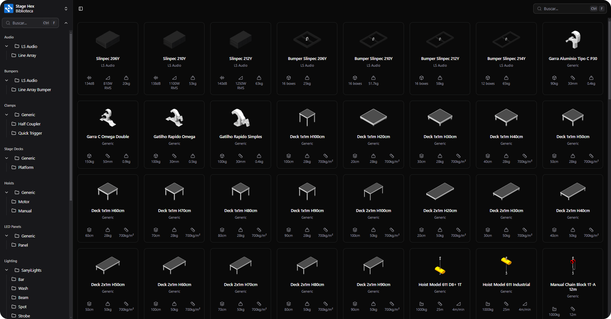
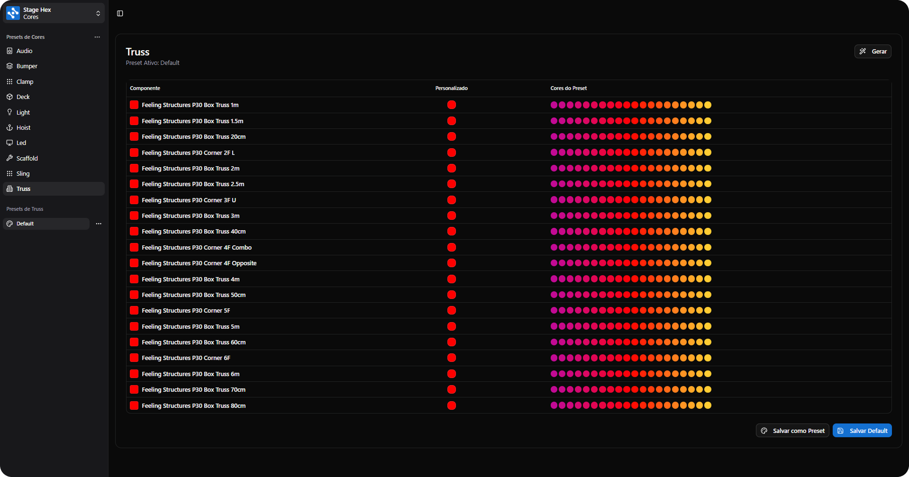
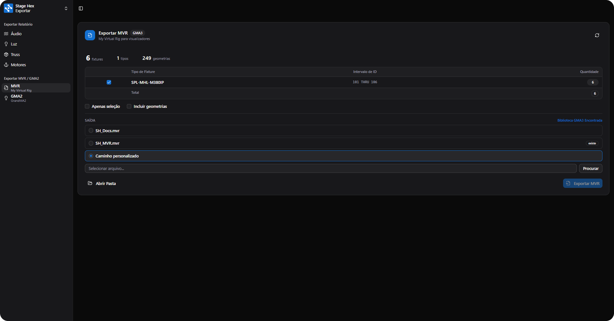

# Gerenciador de Interface

O Gerenciador de Interface é o painel principal do StageHex, acessível através do primeiro botão da barra Main Tools. Oferece acesso centralizado a todas as funcionalidades de gerenciamento do plugin.

***

## Abas do Gerenciador

<table>
<thead>
<tr>
<th>Aba</th>
<th>Função</th>
</tr>
</thead>
<tbody>
<tr>
<td><strong>Assets</strong></td>
<td>Biblioteca de componentes organizados por categoria</td>
</tr>
<tr>
<td><strong>Color System</strong></td>
<td>Configuração de cores padrão dos componentes</td>
</tr>
<tr>
<td><strong>Layers</strong></td>
<td>Gerenciamento de visibilidade e organização</td>
</tr>
<tr>
<td><strong>Exportar</strong></td>
<td>Exportação para MVR e grandMA2</td>
</tr>
</tbody>
</table>

***

## Assets

Biblioteca de assets organizada por categorias, permitindo inserir componentes diretamente no SketchUp.

<figure><figcaption>
Biblioteca de Assets
</figcaption></figure>

### Estrutura de Pastas

A biblioteca é organizada em categorias:

* **Truss** - Treliças e conexões
* **Deck** - Plataformas e acessórios
* **LED** - Painéis LED
* **Audio** - Caixas de som e line arrays
* **Lighting** - Fixtures de iluminação
* **Hoist** - Talhas e cintas
* **Scaffold** - Andaimes

### Funcionalidades

**Navegação por Pastas**
* Clique nas categorias no menu lateral para filtrar
* Subcategorias expandem ao clicar

**Pesquisa**
* Campo de busca no topo da interface
* Pesquisa por nome do asset
* Resultados em tempo real

**Inserção de Assets**
1. Navegue até a categoria desejada
2. Clique no asset para selecioná-lo
3. Clique no modelo para posicionar


Os assets são sincronizados automaticamente da StageHex Cloud conforme seu plano de assinatura.


***

## Color System

Sistema de configuração de cores padrão para identificação visual dos componentes no modelo.

<figure><figcaption>
Sistema de Cores
</figcaption></figure>

### Funcionalidades

**Configuração de Cores**
* Selecione a categoria no menu lateral (Truss, Deck, LED, etc.)
* Visualize os componentes e suas cores atuais
* Clique na cor para alterar

**Presets de Cores**
* Crie presets personalizados
* Salve configurações de cores para reutilização
* Aplique presets com um clique

**Exportar/Importar Presets**
* Exporte presets como arquivo `.json`
* Compartilhe configurações com outros usuários
* Importe presets de terceiros

### Modos de Visualização

Na barra Main Tools, o botão **Controle de Cores** alterna entre:

* **Por Material** - Exibe os materiais originais dos componentes
* **Por Cor** - Aplica as cores configuradas no Color System


Use cores distintas para diferentes tipos de truss ou fabricantes para facilitar a identificação visual no modelo.


***

## Layers

Gerenciador de Camadas para controle total de visibilidade e organização dos componentes StageHex.

<figure><figcaption>
Gerenciador de Camadas
</figcaption></figure>

### Ações Rápidas

<table>
<thead>
<tr>
<th>Botão</th>
<th>Função</th>
</tr>
</thead>
<tbody>
<tr>
<td><strong>Mostrar Tudo</strong></td>
<td>Exibe todos os componentes</td>
</tr>
<tr>
<td><strong>Ocultar Tudo</strong></td>
<td>Oculta todos os componentes</td>
</tr>
<tr>
<td><strong>Detalhar Tudo</strong></td>
<td>Exibe geometria detalhada</td>
</tr>
<tr>
<td><strong>Simplificar Tudo</strong></td>
<td>Exibe geometria simplificada</td>
</tr>
<tr>
<td><strong>Por Material</strong></td>
<td>Cores originais dos materiais</td>
</tr>
<tr>
<td><strong>Por Cor</strong></td>
<td>Cores do Color System</td>
</tr>
</tbody>
</table>

### Lista de Componentes

A lista exibe todos os componentes StageHex organizados hierarquicamente:

**Colunas:**
* **Visibilidade** - Ícones para mostrar/ocultar, detalhar/simplificar, cor/material
* **Asset / Definição** - Nome do componente
* **Instâncias** - Quantidade no modelo
* **Tipo** - Classificação (Platform, Corner, Line Array, Panel, etc.)
* **Classe** - Categoria principal

**Controles por Linha:**
* Olho - Mostrar/Ocultar
* Detalhes - Detalhar/Simplificar
* Cor - Por Material/Por Cor

### Quick Actions na Toolbar

Na barra Main Tools, dois botões permitem alternar rapidamente:

* **Controle de Visualização** (botão 11) - Alterna Detalhado ↔ Simplificado para todos
* **Controle de Cores** (botão 12) - Alterna Material ↔ Cor para todos


Use o modo Simplificado durante a modelagem para melhor performance, e Detalhado para visualização final.


***

## Exportação

### Exportar MVR

Exportação no formato MVR (My Virtual Rig) para softwares de visualização.

<figure><figcaption>
Exportação MVR
</figcaption></figure>

**Informações do Projeto:**
* Quantidade de fixtures
* Tipos de fixtures
* Geometrias incluídas

**Opções de Exportação:**
* **Apenas seleção** - Exporta apenas componentes selecionados
* **Incluir geometrias** - Inclui objetos 3D além dos fixtures

**Destino:**
* Caminhos pré-configurados (Biblioteca GMA3)
* Caminho personalizado


O MVR é compatível com Depence, Capture, Vectorworks, grandMA3 e outros softwares.


### Exportar grandMA2

Exportação para o ecossistema grandMA2/MA3D.

<figure><figcaption>
Exportação grandMA2
</figcaption></figure>

**Exportar Fixtures GMA2:**
* Patch com endereços DMX
* Grupos de fixtures
* Camadas (Tipos ou Tags)

**Opções:**
* **Apenas seleção** - Exporta apenas selecionados
* **Ignorar colisões** - Ignora fixtures com mesmo endereço
* **Camadas por Tipos** ou **Tags**

**Cena MA3D:**
* Exporta geometria 3D para o visualizador MA 3D
* Formato `.gmamedia`
* Opção de sobrescrever arquivo existente

**Destinos de Saída:**
* Pasta do show atual
* Caminho personalizado


Para exportar Cena MA3D, o software MA 3D deve estar instalado no computador.


***

## Disponibilidade por Plano

<table>
<thead>
<tr>
<th>Funcionalidade</th>
<th width="100" align="center">Trial</th>
<th width="100" align="center">Basic</th>
<th width="100" align="center">Pro</th>
</tr>
</thead>
<tbody>
<tr>
<td>Assets - Navegação</td>
<td align="center">✔</td>
<td align="center">✔</td>
<td align="center">✔</td>
</tr>
<tr>
<td>Assets - MA2 Library</td>
<td align="center">✖</td>
<td align="center">✔</td>
<td align="center">✔</td>
</tr>
<tr>
<td>Assets - Depence Library</td>
<td align="center">✖</td>
<td align="center">✖</td>
<td align="center">✔</td>
</tr>
<tr>
<td>Color System</td>
<td align="center">✔</td>
<td align="center">✔</td>
<td align="center">✔</td>
</tr>
<tr>
<td>Layers</td>
<td align="center">✔</td>
<td align="center">✔</td>
<td align="center">✔</td>
</tr>
<tr>
<td>Exportar MVR</td>
<td align="center">✖</td>
<td align="center">✖</td>
<td align="center">✔</td>
</tr>
<tr>
<td>Exportar MA2</td>
<td align="center">✖</td>
<td align="center">✔</td>
<td align="center">✔</td>
</tr>
<tr>
<td>Exportar MA3D Scene</td>
<td align="center">✖</td>
<td align="center">✔</td>
<td align="center">✔</td>
</tr>
</tbody>
</table>
