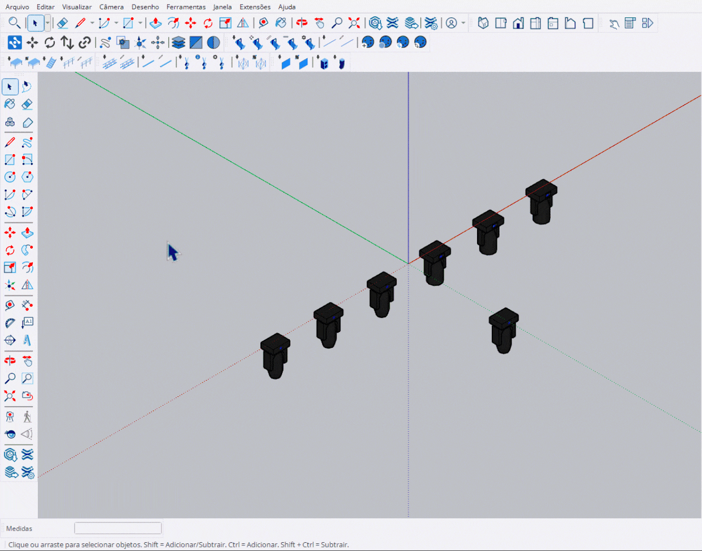

# Mover Objetos

Ferramenta de movimentação com precisão para componentes StageHex.

<figure><figcaption>
Ferramenta Mover Objetos em ação
</figcaption></figure>

***

## Como Usar

### Modo 1: Ativar e Selecionar

1. Ative a ferramenta na barra Main Tools
2. Clique nos componentes para selecioná-los
3. Mova os componentes para a posição desejada

### Modo 2: Selecionar Antes

1. Selecione os componentes desejados
2. Ative a ferramenta
3. Mova os componentes

***

## Controles

<table>
<thead>
<tr>
<th>Tecla</th>
<th>Função</th>
</tr>
</thead>
<tbody>
<tr>
<td><strong>VCB</strong></td>
<td>Digite valores numéricos para movimentação precisa</td>
</tr>
<tr>
<td><strong>Setas do Teclado</strong></td>
<td>Movimento incremental na direção das setas</td>
</tr>
<tr>
<td><strong>Esc</strong></td>
<td>Reinicia a seleção</td>
</tr>
<tr>
<td><strong>Espaço</strong></td>
<td>Sai da ferramenta</td>
</tr>
</tbody>
</table>


VCB (Value Control Box) é a caixa de entrada de valores no canto inferior direito do SketchUp.

