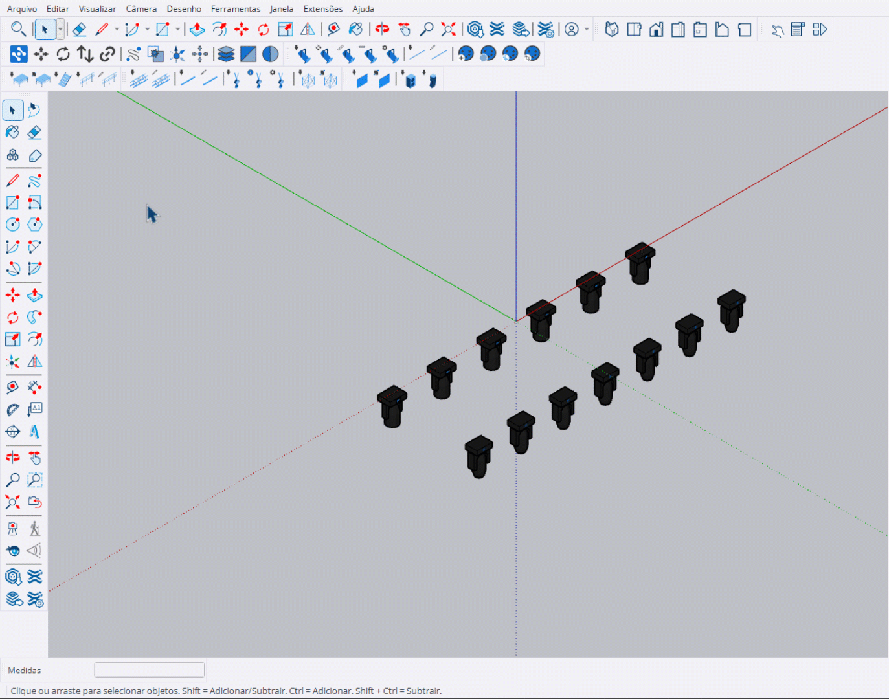

# Selecionar Similares

Ferramenta para selecionar automaticamente componentes similares ao selecionado.

<figure><figcaption>
Ferramenta Selecionar Similares em ação
</figcaption></figure>

***

## Como Usar

### Sem Ctrl: Selecionar Todos

1. Ative a ferramenta na barra Main Tools
2. Clique em um componente
3. Todos os componentes similares serão selecionados automaticamente

### Com Ctrl: Adicionar/Remover

1. Ative a ferramenta na barra Main Tools
2. Segure **Ctrl** e clique em um componente
3. As instâncias similares serão **adicionadas** ou **removidas** da seleção atual

***

## Modos de Operação

<table>
<thead>
<tr>
<th>Modo</th>
<th>Tecla</th>
<th>Comportamento</th>
</tr>
</thead>
<tbody>
<tr>
<td><strong>Selecionar Todos</strong></td>
<td>Clique simples</td>
<td>Seleciona todas as instâncias do componente clicado</td>
</tr>
<tr>
<td><strong>Adicionar/Remover</strong></td>
<td>Ctrl + Clique</td>
<td>Adiciona ou remove instâncias similares da seleção</td>
</tr>
</tbody>
</table>

***

## Controles

<table>
<thead>
<tr>
<th>Tecla</th>
<th>Função</th>
</tr>
</thead>
<tbody>
<tr>
<td><strong>Clique</strong></td>
<td>Seleciona todos os similares</td>
</tr>
<tr>
<td><strong>Ctrl + Clique</strong></td>
<td>Adiciona/Remove da seleção (toggle)</td>
</tr>
<tr>
<td><strong>Esc</strong></td>
<td>Sai da ferramenta</td>
</tr>
<tr>
<td><strong>Ctrl</strong></td>
<td>Sai da ferramenta (quando não clicando)</td>
</tr>
</tbody>
</table>


Útil para selecionar rapidamente todos os fixtures de um mesmo modelo ou todas as treliças de um tipo específico.

