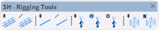

# Rigging Tools

Ferramentas para criação de estruturas de rigging: treliças, tubos, talhas, cintas e andaimes.

<figure><figcaption>
SH - Rigging Tools
</figcaption></figure>

***

## Lista de Ferramentas

<table>
<thead>
<tr>
<th width="50" align="center">#</th>
<th>Ferramenta</th>
<th>Descrição</th>
</tr>
</thead>
<tbody>
<tr>
<td align="center">1</td>
<td><strong>Inserir Treliça</strong></td>
<td>Insere um módulo de treliça</td>
</tr>
<tr>
<td align="center">2</td>
<td><strong>Desenhar Treliça</strong></td>
<td>Desenha treliça ao longo de um caminho</td>
</tr>
<tr>
<td align="center">3</td>
<td><strong>Inserir Tubos</strong></td>
<td>Insere tubos/pipes</td>
</tr>
<tr>
<td align="center">4</td>
<td><strong>Desenhar Tubos</strong></td>
<td>Desenha tubos ao longo de um caminho</td>
</tr>
<tr>
<td align="center">5</td>
<td><strong>Inserir Talha</strong></td>
<td>Insere talha/hoist para suspensão</td>
</tr>
<tr>
<td align="center">6</td>
<td><strong>Ajustar Altura da Talha</strong></td>
<td>Ajusta o trim (altura) da talha</td>
</tr>
<tr>
<td align="center">7</td>
<td><strong>Inserir Cinta</strong></td>
<td>Insere cinta de suspensão no truss</td>
</tr>
<tr>
<td align="center">8</td>
<td><strong>Inserir Andaime</strong></td>
<td>Insere estrutura de andaime</td>
</tr>
<tr>
<td align="center">9</td>
<td><strong>Desenhar Andaime</strong></td>
<td>Desenha andaime interativamente</td>
</tr>
</tbody>
</table>

***

## Detalhes das Ferramentas

### Treliças (Truss)

#### Inserir Treliça

Insere um módulo de treliça no modelo:

* Seleção via HUD de diferentes tipos de truss
* Posicionamento preciso
* Conexão automática entre módulos

#### Desenhar Treliça

Desenha treliças ao longo de um caminho:

1. Selecione o tipo de truss via HUD
2. Clique nos pontos do caminho
3. A treliça é criada automaticamente

### Tubos (Pipes)

#### Inserir Tubos

Insere tubos para suspensão de equipamentos.

#### Desenhar Tubos

Desenha tubos ao longo de linhas selecionadas.

### Talhas (Hoists)

#### Inserir Talha

Insere uma talha (hoist) para suspensão de treliças:

* Seleção via HUD
* Configuração de capacidade
* Posicionamento automático

#### Ajustar Altura da Talha

Ajusta o trim (altura de trabalho) da talha:

* Clique na talha para selecionar
* Arraste para ajustar a altura
* Valores numéricos via VCB (Value Control Box)

#### Inserir Cinta

Insere cinta de suspensão (sling) conectando talha ao truss:

* Conexão automática
* Diferentes tipos de cintas

### Andaimes (Scaffolds)

#### Inserir Andaime

Insere uma estrutura de andaime:

* Configuração de dimensões
* Altura ajustável
* Diferentes configurações

#### Desenhar Andaime

Desenha andaimes interativamente definindo a área de cobertura.

***

## Disponibilidade por Plano

<table>
<thead>
<tr>
<th>Ferramenta</th>
<th width="100" align="center">Trial</th>
<th width="100" align="center">Basic</th>
<th width="100" align="center">Pro</th>
</tr>
</thead>
<tbody>
<tr>
<td>Inserir Treliça</td>
<td align="center">✔</td>
<td align="center">✖</td>
<td align="center">✔</td>
</tr>
<tr>
<td>Desenhar Treliça</td>
<td align="center">✔</td>
<td align="center">✖</td>
<td align="center">✔</td>
</tr>
<tr>
<td>Inserir Tubos</td>
<td align="center">✔</td>
<td align="center">✖</td>
<td align="center">✔</td>
</tr>
<tr>
<td>Desenhar Tubos</td>
<td align="center">✔</td>
<td align="center">✖</td>
<td align="center">✔</td>
</tr>
<tr>
<td>Inserir Talha</td>
<td align="center">✔</td>
<td align="center">✖</td>
<td align="center">✔</td>
</tr>
<tr>
<td>Ajustar Altura da Talha</td>
<td align="center">✔</td>
<td align="center">✖</td>
<td align="center">✔</td>
</tr>
<tr>
<td>Inserir Cinta</td>
<td align="center">✔</td>
<td align="center">✖</td>
<td align="center">✔</td>
</tr>
<tr>
<td>Inserir Andaime</td>
<td align="center">✔</td>
<td align="center">✖</td>
<td align="center">✔</td>
</tr>
<tr>
<td>Desenhar Andaime</td>
<td align="center">✔</td>
<td align="center">✖</td>
<td align="center">✔</td>
</tr>
</tbody>
</table>


As Rigging Tools não estão disponíveis no plano StageHex Basic.

