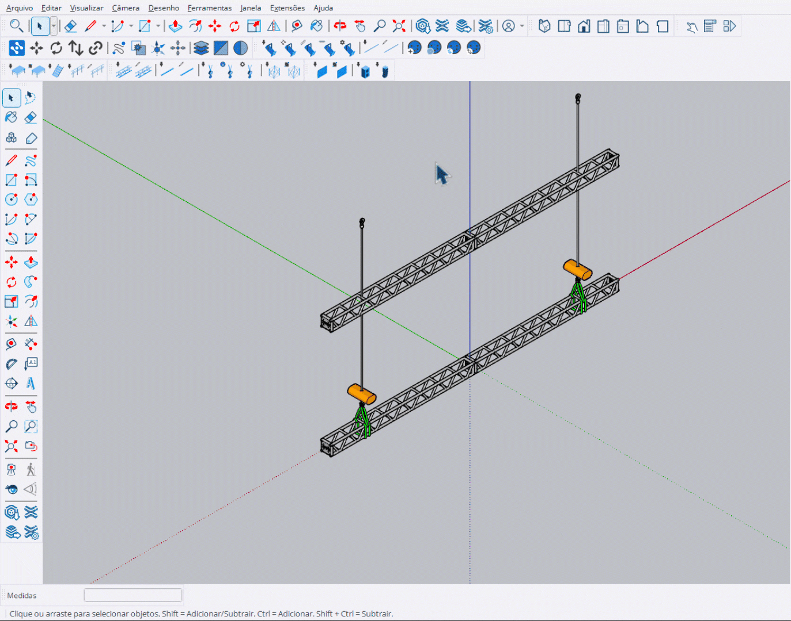

# Ajustar Altura (Trim)

Ferramenta para ajustar a altura (trim) de talhas selecionadas.

<figure><figcaption>
Ajustando altura de talhas selecionadas
</figcaption></figure>

***

## Como Usar

1. **Selecione** as talhas (hoists) que deseja ajustar
2. Ative a ferramenta **Ajustar Altura**
3. Use **↑** para modo **subir** ou **↓** para modo **descer**
4. **Clique** em um truss/cinta para definir a nova altura
5. Todas as talhas selecionadas são ajustadas igualmente


Você deve selecionar as talhas **antes** de ativar a ferramenta.


***

## Controles

<table>
<thead>
<tr>
<th width="180">Tecla</th>
<th>Ação</th>
</tr>
</thead>
<tbody>
<tr>
<td><strong>↑</strong></td>
<td>Modo subir (bottom fixo, top sobe)</td>
</tr>
<tr>
<td><strong>↓</strong></td>
<td>Modo descer (top fixo, bottom desce)</td>
</tr>
<tr>
<td><strong>Enter</strong></td>
<td>Aplicar e sair</td>
</tr>
<tr>
<td><strong>Esc</strong></td>
<td>Cancelar / Sair</td>
</tr>
</tbody>
</table>

***

## Modos de Ajuste

<table>
<thead>
<tr>
<th width="150">Modo</th>
<th>Comportamento</th>
</tr>
</thead>
<tbody>
<tr>
<td><strong>Subir (↑)</strong></td>
<td>Ponto inferior fixo, ponto superior sobe</td>
</tr>
<tr>
<td><strong>Descer (↓)</strong></td>
<td>Ponto superior fixo, ponto inferior desce</td>
</tr>
</tbody>
</table>

***

## Entrada VCB

Você pode definir a altura exata via VCB:

<table>
<thead>
<tr>
<th width="150">Formato</th>
<th>Exemplo</th>
<th>Resultado</th>
</tr>
</thead>
<tbody>
<tr>
<td><code>Xcm</code></td>
<td><code>400cm</code></td>
<td>Define altura para 400cm</td>
</tr>
<tr>
<td><code>Xm</code></td>
<td><code>4m</code></td>
<td>Define altura para 4 metros</td>
</tr>
</tbody>
</table>

***

## Ajuste em Grupo

Quando múltiplas talhas são selecionadas:

- Todas são ajustadas **igualmente**
- A **linearidade** é mantida
- O movimento é **sincronizado**


Útil para ajustar uma linha inteira de talhas de uma vez, mantendo o alinhamento.

