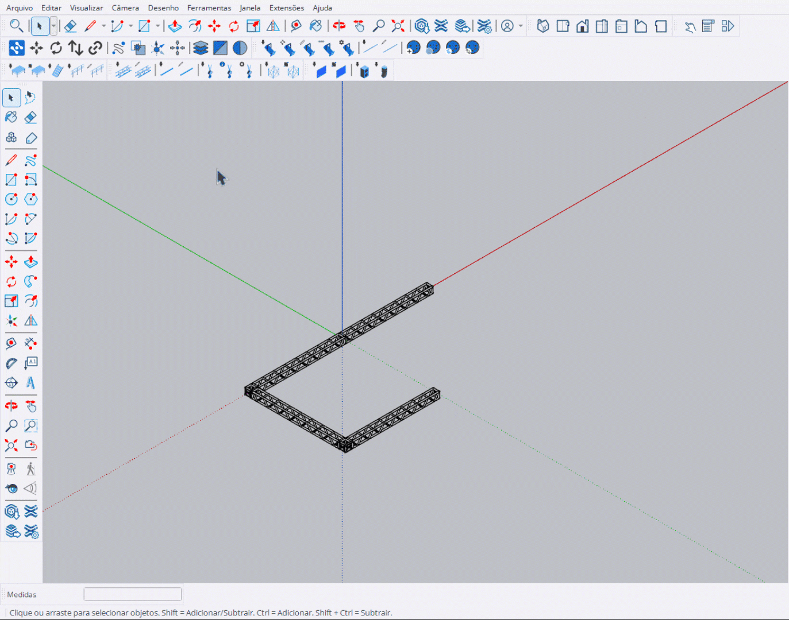

# Desenhar Truss

Ferramenta para distribuir trusses ao longo de um caminho ou direção.

<figure><figcaption>
Distribuindo trusses ao longo de um caminho
</figcaption></figure>

***

## Como Usar

### Modo Snap Chain

1. Ative a ferramenta **Desenhar Truss**
2. Selecione o modelo no **HUD**
3. Clique em um **snap** de truss existente para iniciar
4. Mova o cursor na direção desejada
5. Os trusses são conectados em sequência via snaps
6. **Clique** para finalizar o caminho

### Modo Linha Livre

1. **1º clique**: Define o ponto inicial
2. Mova o cursor para definir a direção
3. **2º clique**: Define o ponto final
4. Os trusses são distribuídos ao longo da linha


O sistema calcula automaticamente quantos trusses cabem no caminho definido.


***

## Controles

<table>
<thead>
<tr>
<th width="180">Tecla</th>
<th>Ação</th>
</tr>
</thead>
<tbody>
<tr>
<td><strong>Ctrl</strong></td>
<td>Modo Pick - seleciona truss como referência</td>
</tr>
<tr>
<td><strong>Alt</strong></td>
<td>Alternar opções de rotação</td>
</tr>
<tr>
<td><strong>Enter</strong></td>
<td>Aplicar e sair</td>
</tr>
<tr>
<td><strong>Esc</strong></td>
<td>Cancelar / Sair</td>
</tr>
</tbody>
</table>

***

## Preview

Durante o desenho, a ferramenta exibe:

- **Preview** de todos os trusses que serão criados
- **Linha amarela** indicando a direção
- **Pontos de snap** disponíveis para conexão

***

## Função Pick

Pressione **Ctrl** para ativar o modo Pick:

<figure><figcaption>
Selecionando truss como referência
</figcaption></figure>

1. Segure **Ctrl** para entrar no modo Pick
2. Clique em um truss existente
3. A ferramenta passa a usar o mesmo modelo
