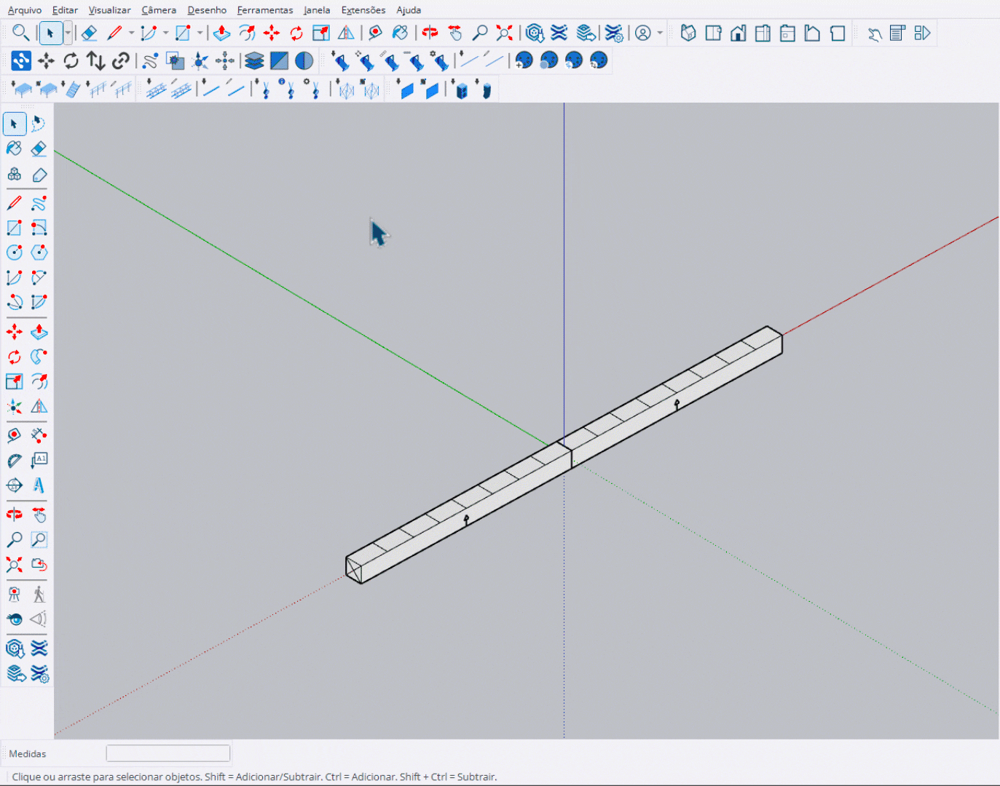

# Inserir Cinta (Sling)

Ferramenta para posicionar cintas (slings) no truss.

<figure><figcaption>
Posicionando cintas no truss
</figcaption></figure>

***

## Como Usar

1. Ative a ferramenta **Inserir Cinta**
2. Selecione o modelo no **HUD**
3. Aproxime o cursor de um **truss**
4. **Clique** para posicionar a cinta


A cinta é automaticamente **rotacionada** para alinhar com a direção do truss.


***

## Controles

<table>
<thead>
<tr>
<th width="180">Tecla</th>
<th>Ação</th>
</tr>
</thead>
<tbody>
<tr>
<td><strong>Enter</strong></td>
<td>Finalizar e sair</td>
</tr>
<tr>
<td><strong>Esc</strong></td>
<td>Cancelar / Sair</td>
</tr>
</tbody>
</table>

***

## Posicionamento Automático

A ferramenta detecta automaticamente:

- **Eixo do truss**: A cinta é centralizada no eixo longitudinal
- **Rotação**: A cinta é rotacionada para alinhar com o truss
- **Face**: Detecta se está na parte superior ou inferior do truss

***

## Orientação

<table>
<thead>
<tr>
<th width="150">Posição</th>
<th>Comportamento</th>
</tr>
</thead>
<tbody>
<tr>
<td><strong>Cima</strong></td>
<td>Cinta posicionada na parte superior do truss</td>
</tr>
<tr>
<td><strong>Baixo</strong></td>
<td>Cinta invertida (180°) na parte inferior</td>
</tr>
</tbody>
</table>

***

## Ponto SHACKLE

Cada cinta possui um ponto **SHACKLE** que é usado para:

- Conexão com talhas (hoists)
- Referência de posicionamento
- Cálculo de altura


O ponto SHACKLE é o ponto de ancoragem da cinta onde a talha será conectada.

