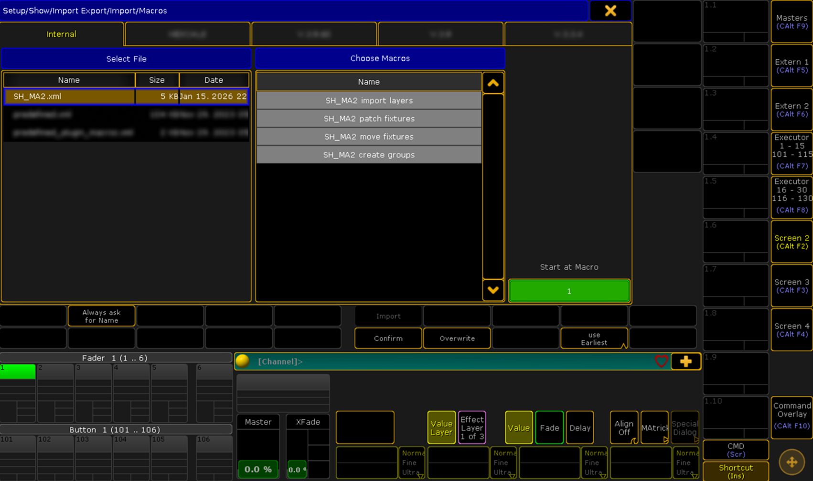
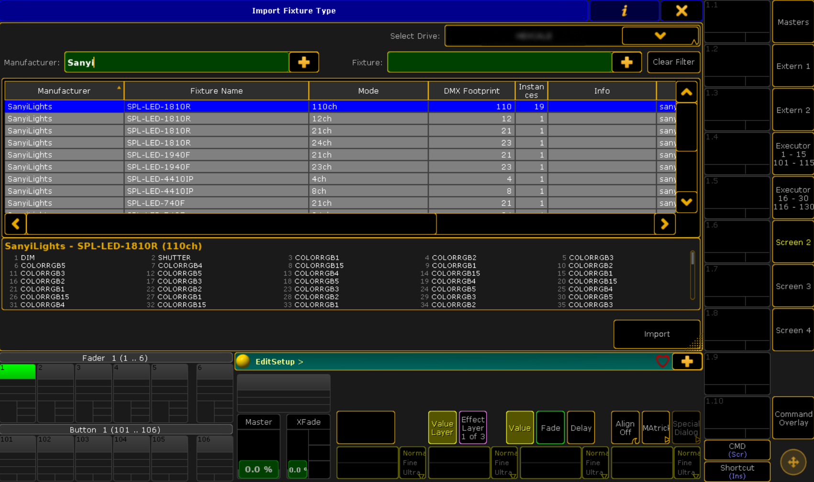
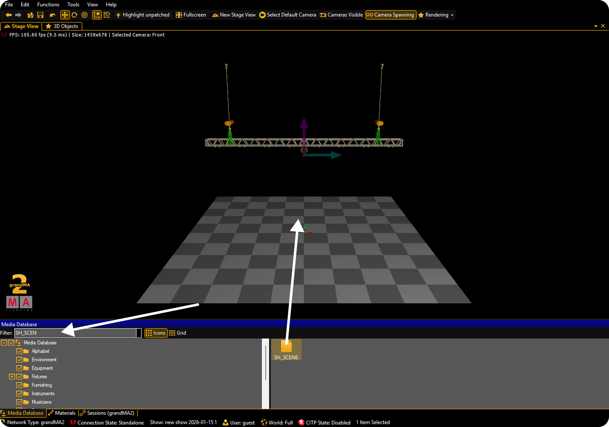

# grandMA2

Integração do StageHex com o ecossistema grandMA2, incluindo instalação automática da biblioteca de fixtures StageHex e exportação para MA 3D.

***

## Biblioteca StageHex para MA2

A **StageHex Cloud** instala automaticamente a biblioteca de fixtures **StageHex** no grandMA2.

### Detecção Automática

O sistema detecta automaticamente instalações do grandMA2:

- **Caminho base**: `C:\ProgramData\MA Lighting Technologies\grandma`
- **Versões**: Detecta todas as versões `gma2_V_*` instaladas
- **Seleção**: Usa a versão mais recente por padrão

### Instalação Automática

A biblioteca de fixtures StageHex é instalada em:

```
C:\ProgramData\MA Lighting Technologies\grandma\gma2_V_X.X.X\library\
```


A instalação é feita automaticamente pela StageHex Cloud. Basta manter o aplicativo aberto para receber atualizações da biblioteca.


***

## Exportando do SketchUp

Para exportar seu projeto para grandMA2:

1. Abra o **Gerenciador de Interface** (primeiro botão da Main Tools)
2. Vá para a aba **Exportar**
3. Selecione **grandMA2**

O StageHex exporta:

- **Arquivos XML**: Contém patch, posições dos fixtures e grupos
- **SH_SCENE.gmamedia**: Cena 3D para o MA 3D (apenas onPC)

Veja detalhes em: [Exportar grandMA2](plugin-sketchup/ferramentas/main-tools/interface.md#exportar-grandma2)

***

## Importando no grandMA2

### Importando Macros

Após exportar do SketchUp, importe as macros no grandMA2:

<figure><figcaption><p>Importando macros do StageHex no grandMA2</p></figcaption></figure>

**Passos:**

1. No grandMA2, vá para **Setup → Import Export → Import**
2. Selecione os arquivos de macro (`.xml`)
3. Execute as macros conforme necessário

### Macros Disponíveis

<table>
<thead>
<tr>
<th>Macro</th>
<th>Função</th>
</tr>
</thead>
<tbody>
<tr>
<td><strong>Import Layers</strong></td>
<td>Importa as Layers baseado na Tag ou Tipo configurado no SketchUp</td>
</tr>
<tr>
<td><strong>Patch Fixtures</strong></td>
<td>Importa o Patch com endereços DMX exportados do SketchUp</td>
</tr>
<tr>
<td><strong>Move Fixtures</strong></td>
<td>Posiciona os fixtures nas coordenadas 3D do projeto</td>
</tr>
<tr>
<td><strong>Create Groups</strong></td>
<td>Cria grupos de fixtures por Tipo ou Tag</td>
</tr>
</tbody>
</table>


Execute as macros na ordem: Import Layers → Patch Fixtures → Move Fixtures → Create Groups.


### Selecionando Fixtures StageHex

<figure><figcaption><p>Fixtures da biblioteca StageHex no grandMA2</p></figcaption></figure>

**Para adicionar fixtures manualmente:**

1. Vá para **Setup → Patch & Fixture Schedule**
2. Selecione **Add Fixtures**
3. Pesquise pelo nome do **Manufacturer + Fixture** usado no SketchUp
4. Selecione o fixture correspondente


Use o mesmo nome de fabricante e modelo que aparece no SketchUp para garantir compatibilidade.


***

## Importando no MA 3D

A cena 3D exportada pelo StageHex pode ser importada no MA 3D.

<figure><figcaption><p>Importando SH_SCENE no MA 3D</p></figcaption></figure>

### Arquivo SH_SCENE

O StageHex exporta um arquivo `SH_SCENE.gmamedia` contendo:

- Geometria 3D do palco
- Estruturas de truss
- Posições dos fixtures
- Elementos de cenário

### Passos para Importar

1. No MA 3D, abra o **Media Database**
2. Pesquise por **SH_SCENE**
3. Arraste o arquivo para o **Viewport**


O arquivo SH_SCENE é suportado apenas no **grandMA2 onPC** com MA 3D. O grandMA2 Console suporta apenas os arquivos XML.


***

## Compatibilidade

### grandMA2 onPC

<table>
<thead>
<tr>
<th>Recurso</th>
<th width="150" align="center">Suportado</th>
</tr>
</thead>
<tbody>
<tr>
<td><strong>Macros XML</strong> (Patch, Layers, Groups)</td>
<td align="center">✔</td>
</tr>
<tr>
<td><strong>SH_SCENE</strong> (Cena 3D para MA 3D)</td>
<td align="center">✔</td>
</tr>
</tbody>
</table>

### grandMA2 Console

<table>
<thead>
<tr>
<th>Recurso</th>
<th width="150" align="center">Suportado</th>
</tr>
</thead>
<tbody>
<tr>
<td><strong>Macros XML</strong> (Patch, Layers, Groups)</td>
<td align="center">✔</td>
</tr>
<tr>
<td><strong>SH_SCENE</strong> (Cena 3D)</td>
<td align="center">✖</td>
</tr>
</tbody>
</table>

***

## Atualizações Automáticas

A StageHex Cloud gerencia automaticamente:

- **Detecção de versão**: Identifica todas as versões do grandMA2 instaladas
- **Instalação da biblioteca**: Instala os fixtures StageHex na pasta library
- **Atualização**: Sincroniza novos fixtures quando disponíveis
- **Configuração de caminhos**: Ajusta paths automaticamente


Mantenha a StageHex Cloud aberta para receber atualizações automáticas da biblioteca de fixtures.

