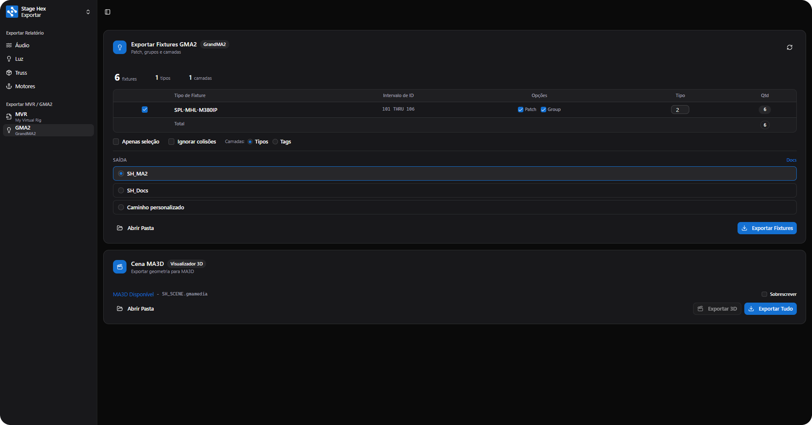

# Exportando para grandMA2

Para exportar seu projeto do StageHex para o grandMA2:

1. Abra o **Gerenciador de Interface** (primeiro botão da Main Tools)
2. Vá para a aba **Exportar**
3. Selecione **grandMA2**

<figure><figcaption>
Tela de exportação grandMA2
</figcaption></figure>

***

## Tabela de Fixtures

A tabela exibe todos os fixtures do projeto com as seguintes colunas:

<table>
<thead>
<tr>
<th width="150">Coluna</th>
<th>Descrição</th>
</tr>
</thead>
<tbody>
<tr>
<td><strong>Checkbox</strong></td>
<td>Seleciona o tipo de fixture para exportação</td>
</tr>
<tr>
<td><strong>Tipo de Fixture</strong></td>
<td>Nome do fixture (Manufacturer + Model)</td>
</tr>
<tr>
<td><strong>Intervalo de ID</strong></td>
<td>Range de Fixture IDs (ex: 1-10)</td>
</tr>
<tr>
<td><strong>Patch</strong></td>
<td>Inclui no macro de patch</td>
</tr>
<tr>
<td><strong>Group</strong></td>
<td>Inclui no macro de grupos</td>
</tr>
<tr>
<td><strong>Tipo</strong></td>
<td>Fixture Type ID para o grandMA2</td>
</tr>
<tr>
<td><strong>Qtd</strong></td>
<td>Quantidade de fixtures deste tipo</td>
</tr>
</tbody>
</table>

***

## Opções de Exportação

<table>
<thead>
<tr>
<th width="180">Opção</th>
<th>Descrição</th>
</tr>
</thead>
<tbody>
<tr>
<td><strong>Apenas seleção</strong></td>
<td>Exporta somente fixtures selecionados no SketchUp</td>
</tr>
<tr>
<td><strong>Ignorar colisões</strong></td>
<td>Exporta mesmo com endereços DMX duplicados</td>
</tr>
<tr>
<td><strong>Camadas: Tipos</strong></td>
<td>Cria camadas baseadas no tipo de fixture</td>
</tr>
<tr>
<td><strong>Camadas: Tags</strong></td>
<td>Cria camadas baseadas nas Tags do SketchUp</td>
</tr>
</tbody>
</table>

***

## Destino de Saída

<table>
<thead>
<tr>
<th width="180">Opção</th>
<th>Descrição</th>
</tr>
</thead>
<tbody>
<tr>
<td><strong>SH_MA2</strong></td>
<td>Sobrescreve arquivos padrão na pasta do grandMA2</td>
</tr>
<tr>
<td><strong>SH_Project</strong></td>
<td>Usa o nome do projeto do SketchUp</td>
</tr>
<tr>
<td><strong>Personalizado</strong></td>
<td>Escolhe pasta de destino manualmente</td>
</tr>
</tbody>
</table>


Se o grandMA2 estiver instalado, o StageHex detecta automaticamente e exporta diretamente para as pastas corretas.


***

## Arquivos Exportados

O StageHex gera os seguintes arquivos:

<table>
<thead>
<tr>
<th width="250">Arquivo</th>
<th>Descrição</th>
</tr>
</thead>
<tbody>
<tr>
<td><strong>SH_MA2-LAYER-N.xml</strong></td>
<td>Arquivos de camada com fixtures (um por camada)</td>
</tr>
<tr>
<td><strong>SH_MA2.xml</strong></td>
<td>Macro com comandos de importação</td>
</tr>
</tbody>
</table>

***

## Exportando Cena MA3D

O StageHex exporta a geometria 3D do projeto para o visualizador MA 3D.

### Opções

<table>
<thead>
<tr>
<th width="180">Opção</th>
<th>Descrição</th>
</tr>
</thead>
<tbody>
<tr>
<td><strong>Sobrescrever</strong></td>
<td>Sobrescreve o arquivo SH_SCENE existente</td>
</tr>
<tr>
<td><strong>Exportar 3D</strong></td>
<td>Exporta apenas a cena 3D</td>
</tr>
<tr>
<td><strong>Exportar Tudo</strong></td>
<td>Exporta fixtures + cena 3D em sequência</td>
</tr>
</tbody>
</table>

### Arquivo Exportado

O StageHex exporta um arquivo `SH_SCENE.gmamedia` contendo:

- Geometria 3D do palco
- Estruturas de truss
- Elementos de cenário


A exportação de Cena MA3D requer o **MA 3D** instalado no computador.

