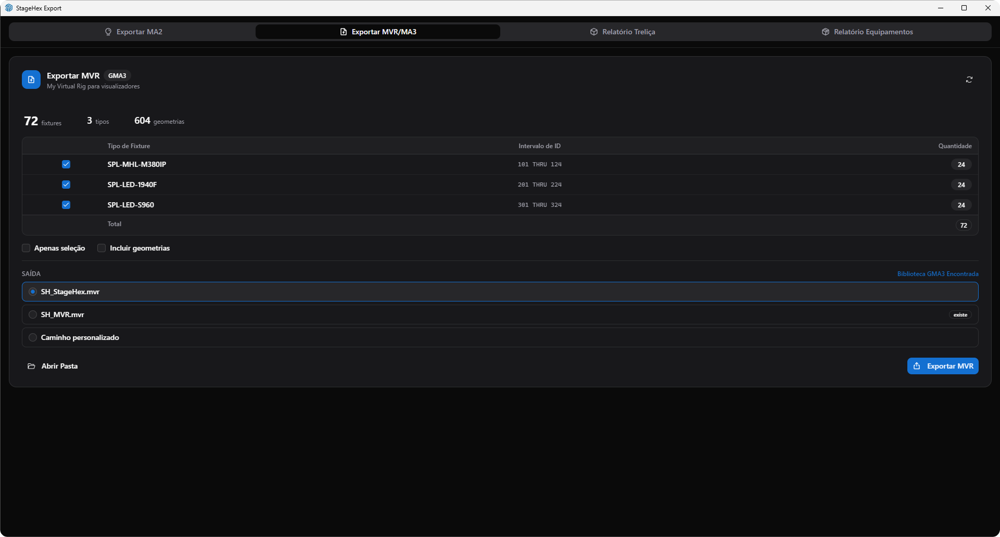

# Exportando para grandMA3

Para exportar seu projeto da StageHex para o grandMA3:

1. No SketchUp, acesse **Arquivo → StageHex Export → Export MVR - My Virtual Rig...**
2. Ou pressione o atalho configurado

<figure><figcaption>
Tela de exportação MVR
</figcaption></figure>

***

## Configurando a Exportação

### Resumo do Projeto

No topo da interface são exibidos:

* **Fixtures** - Quantidade total de fixtures no projeto
* **Tipos** - Quantidade de tipos diferentes de fixtures
* **Geometrias** - Quantidade de geometrias 3D incluídas

### Tabela de Fixtures

* **Tipo de Fixture** - Nome do fixture (Fabricante + Modelo)
* **Intervalo de ID** - Range de Fixture IDs (ex: 101 THRU 124)
* **Quantidade** - Quantidade de fixtures deste tipo

### Opções Disponíveis

* **Apenas seleção** - Exporta somente fixtures selecionados no SketchUp
* **Incluir geometrias** - Adiciona elementos 3D (palco, trusses, cenário) ao MVR

### Destino de Saída

* **SH_StageHex.mvr** - Exporta diretamente para a biblioteca do grandMA3
* **SH_MVR.mvr** - Sobrescreve arquivo padrão na biblioteca GMA3
* **Caminho personalizado** - Escolhe arquivo de destino manualmente


O indicador **Biblioteca GMA3 Encontrada** confirma que o grandMA3 está instalado e o arquivo será exportado diretamente para a pasta MVR.


***

## Formato MVR

O **MVR** (My Virtual Rig) é um formato padrão da indústria que inclui:

* **Fixtures** com posicionamento 3D e patch DMX
* **Arquivos GDTF** embutidos para cada tipo de fixture
* **Geometrias 3D** do palco e cenário (opcional)

Veja detalhes completos em: [Exportar e Relatórios → Exportar MVR/MA3](../plugin-sketchup/exportacao.md#exportar-mvr-ma3)
