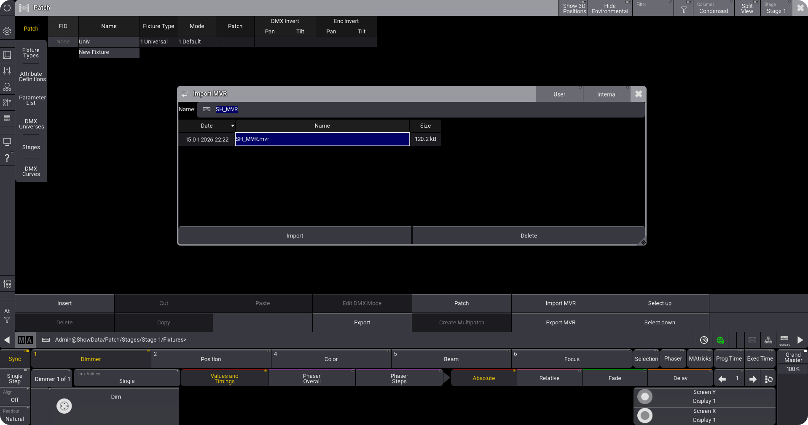
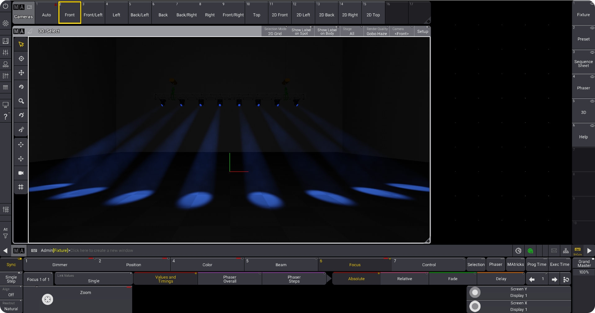

# Importando no grandMA3

Após exportar o MVR do SketchUp, importe no grandMA3.

***

## Importando Arquivo MVR

<figure><figcaption>
Importando arquivo MVR exportado pelo StageHex no grandMA3
</figcaption></figure>

**Passos:**

1. No grandMA3, vá para **Menu → Import → MVR**
2. Navegue até o arquivo `.mvr` exportado pelo StageHex
3. Selecione as opções de importação
4. Confirme a importação

***

## Visualização 3D

Após importar, visualize o projeto no 3D do grandMA3:

<figure><figcaption>
Projeto StageHex visualizado no 3D do grandMA3
</figcaption></figure>

***

## Elementos Importados

- Fixtures com posicionamento 3D
- Patch DMX configurado
- Geometria do palco (se exportada)
- Estruturas de truss
