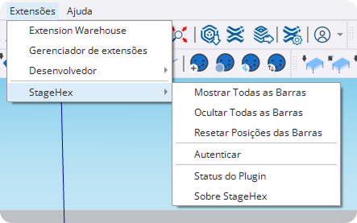
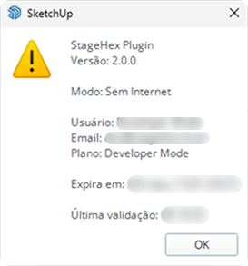
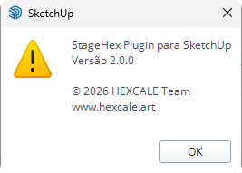

# Plugin SketchUp

O plugin StageHex adiciona um menu de configurações no SketchUp para gerenciar barras de ferramentas, autenticação e informações do plugin.

***

## Acessando o Menu

No SketchUp, acesse:

**Extensões → StageHex**

<figure><figcaption>
Menu da extensão StageHex no SketchUp
</figcaption></figure>

***

## Opções do Menu

<table>
<thead>
<tr>
<th>Opção</th>
<th>Descrição</th>
</tr>
</thead>
<tbody>
<tr>
<td><strong>Mostrar Todas as Barras</strong></td>
<td>Exibe todas as barras de ferramentas da StageHex</td>
</tr>
<tr>
<td><strong>Ocultar Todas as Barras</strong></td>
<td>Oculta todas as barras de ferramentas da StageHex</td>
</tr>
<tr>
<td><strong>Resetar Posições das Barras</strong></td>
<td>Restaura as barras de ferramentas para suas posições padrão</td>
</tr>
<tr>
<td><strong>Autenticar</strong></td>
<td>Permite autenticação manual caso a comunicação com a StageHex Cloud falhe</td>
</tr>
<tr>
<td><strong>Status do Plugin</strong></td>
<td>Exibe informações sobre o estado atual do plugin e da licença</td>
</tr>
<tr>
<td><strong>Sobre StageHex</strong></td>
<td>Mostra informações sobre a versão do plugin</td>
</tr>
</tbody>
</table>

***

## Autenticação Manual

A opção **Autenticar** permite realizar a autenticação manualmente quando houver problemas de comunicação com a StageHex Cloud.


Use esta opção apenas se o plugin apresentar falha na autenticação automática. Em condições normais, a autenticação é feita automaticamente ao iniciar o SketchUp.


**Quando usar:**

* Após queda de conexão com a internet
* Se o plugin exibir mensagem de erro de autenticação
* Quando o status mostrar "Sem Internet" ou "Não autenticado"

***

## Status do Plugin

Exibe informações detalhadas sobre o estado atual do plugin e da licença.

<figure><figcaption>
Janela de status do plugin
</figcaption></figure>

### Informações Exibidas

<table>
<thead>
<tr>
<th>Campo</th>
<th>Descrição</th>
</tr>
</thead>
<tbody>
<tr>
<td><strong>Versão</strong></td>
<td>Versão atual do plugin instalado</td>
</tr>
<tr>
<td><strong>Modo</strong></td>
<td>Estado da conexão (Online / Sem Internet)</td>
</tr>
<tr>
<td><strong>Usuário</strong></td>
<td>Nome do usuário autenticado</td>
</tr>
<tr>
<td><strong>Email</strong></td>
<td>Email da conta StageHex</td>
</tr>
<tr>
<td><strong>Plano</strong></td>
<td>Plano de assinatura ativo (Trial, Basic ou Pro)</td>
</tr>
<tr>
<td><strong>Expira em</strong></td>
<td>Data de expiração da licença</td>
</tr>
<tr>
<td><strong>Última validação</strong></td>
<td>Data e hora da última verificação de licença</td>
</tr>
</tbody>
</table>


O ícone de aviso indica que o plugin está operando em modo offline. Neste modo, algumas funcionalidades podem estar limitadas até que a conexão seja restabelecida.


***

## Sobre StageHex

Exibe informações sobre a versão do plugin e os desenvolvedores.

<figure><figcaption>
Janela Sobre StageHex
</figcaption></figure>

**Informações exibidas:**

* Nome do plugin
* Versão instalada
* Copyright e equipe de desenvolvimento
* Website oficial


Visite [hexcale.art](https://www.hexcale.art) para mais informações sobre o desenvolvimento da StageHex.

