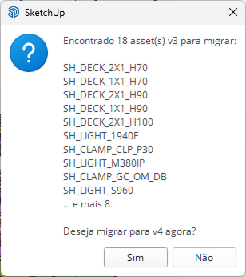
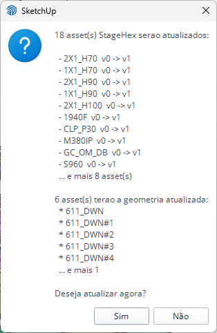
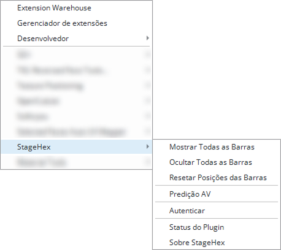
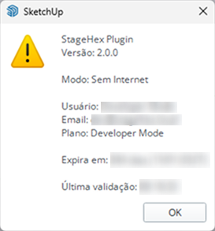
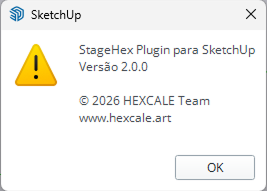

# Plugin SketchUp

O plugin StageHex adiciona um menu de configurações no SketchUp para gerenciar barras de ferramentas, autenticação e informações do plugin.

***

## Migração de Projetos Antigos (v3 → v4)

Ao abrir um projeto criado com versões anteriores do StageHex (v3), o plugin detecta automaticamente os assets antigos e oferece a opção de migrá-los para o novo formato (v4).

<figure><figcaption>
Diálogo de migração de assets antigos
</figcaption></figure>

### O que acontece na migração?

* Os assets são atualizados com novos metadados internos (identificadores únicos)
* A geometria e posicionamento dos assets permanecem inalterados
* O processo é reversível através do comando **Desfazer** (Ctrl+Z)


A migração é necessária para que os assets possam receber atualizações futuras da biblioteca StageHex.


### Como proceder

1. Clique em **Sim** para migrar os assets automaticamente
2. Aguarde o processo ser concluído
3. Salve o projeto para preservar as alterações


Recomendamos fazer backup do projeto antes de migrar, especialmente em projetos grandes ou complexos.


***

## Atualização de Assets

Ao abrir um projeto, o plugin verifica se há assets da biblioteca StageHex com versões mais recentes disponíveis. Caso existam atualizações, um diálogo é exibido perguntando se deseja atualizar.

<figure><figcaption>
Diálogo de atualização de assets
</figcaption></figure>

### Informações exibidas

O diálogo mostra:

* **Quantidade de assets** que serão atualizados
* **Lista de assets** com a versão atual e a nova versão (ex: v0 → v1)
* **Assets com geometria atualizada** (quando houver alterações no modelo 3D)

### O que é atualizado?

<table>
<thead>
<tr>
<th>Tipo de Atualização</th>
<th>Descrição</th>
</tr>
</thead>
<tbody>
<tr>
<td><strong>Metadados</strong></td>
<td>Informações técnicas como peso, potência, fabricante, etc.</td>
</tr>
<tr>
<td><strong>Geometria</strong></td>
<td>Modelo 3D do asset (quando indicado no diálogo)</td>
</tr>
</tbody>
</table>


As atualizações de geometria substituem o modelo 3D do asset, mas mantêm o posicionamento e rotação no projeto.


### Como proceder

1. Revise a lista de assets que serão atualizados
2. Clique em **Sim** para aplicar as atualizações
3. Clique em **Não** para manter os assets nas versões atuais


Se você fez modificações manuais em algum asset StageHex, a atualização de geometria substituirá essas alterações.


***

## Acessando o Menu

No SketchUp, acesse:

**Extensões → StageHex**

<figure><figcaption>
Menu da extensão StageHex no SketchUp
</figcaption></figure>

***

## Opções do Menu

<table>
<thead>
<tr>
<th>Opção</th>
<th>Descrição</th>
</tr>
</thead>
<tbody>
<tr>
<td><strong>Mostrar Todas as Barras</strong></td>
<td>Exibe todas as barras de ferramentas da StageHex</td>
</tr>
<tr>
<td><strong>Ocultar Todas as Barras</strong></td>
<td>Oculta todas as barras de ferramentas da StageHex</td>
</tr>
<tr>
<td><strong>Resetar Posições das Barras</strong></td>
<td>Restaura as barras de ferramentas para suas posições padrão</td>
</tr>
<tr>
<td><strong>Autenticar</strong></td>
<td>Permite autenticação manual caso a comunicação com a StageHex Cloud falhe</td>
</tr>
<tr>
<td><strong>Status do Plugin</strong></td>
<td>Exibe informações sobre o estado atual do plugin e da licença</td>
</tr>
<tr>
<td><strong>Sobre StageHex</strong></td>
<td>Mostra informações sobre a versão do plugin</td>
</tr>
</tbody>
</table>

***

## Autenticação Manual

A opção **Autenticar** permite realizar a autenticação manualmente quando houver problemas de comunicação com a StageHex Cloud.


Use esta opção apenas se o plugin apresentar falha na autenticação automática. Em condições normais, a autenticação é feita automaticamente ao iniciar o SketchUp.


**Quando usar:**

* Após queda de conexão com a internet
* Se o plugin exibir mensagem de erro de autenticação
* Quando o status mostrar "Sem Internet" ou "Não autenticado"

***

## Status do Plugin

Exibe informações detalhadas sobre o estado atual do plugin e da licença.

<figure><figcaption>
Janela de status do plugin
</figcaption></figure>

### Informações Exibidas

<table>
<thead>
<tr>
<th>Campo</th>
<th>Descrição</th>
</tr>
</thead>
<tbody>
<tr>
<td><strong>Versão</strong></td>
<td>Versão atual do plugin instalado</td>
</tr>
<tr>
<td><strong>Modo</strong></td>
<td>Estado da conexão (Online / Sem Internet)</td>
</tr>
<tr>
<td><strong>Usuário</strong></td>
<td>Nome do usuário autenticado</td>
</tr>
<tr>
<td><strong>Email</strong></td>
<td>Email da conta StageHex</td>
</tr>
<tr>
<td><strong>Plano</strong></td>
<td>Plano de assinatura ativo (Trial, Basic ou Pro)</td>
</tr>
<tr>
<td><strong>Expira em</strong></td>
<td>Data de expiração da licença</td>
</tr>
<tr>
<td><strong>Última validação</strong></td>
<td>Data e hora da última verificação de licença</td>
</tr>
</tbody>
</table>


O ícone de aviso indica que o plugin está operando em modo offline. Neste modo, algumas funcionalidades podem estar limitadas até que a conexão seja restabelecida.


***

## Sobre StageHex

Exibe informações sobre a versão do plugin e os desenvolvedores.

<figure><figcaption>
Janela Sobre StageHex
</figcaption></figure>

**Informações exibidas:**

* Nome do plugin
* Versão instalada
* Copyright e equipe de desenvolvimento
* Website oficial


Visite [hexcale.art](https://www.hexcale.art) para mais informações sobre o desenvolvimento da StageHex.

