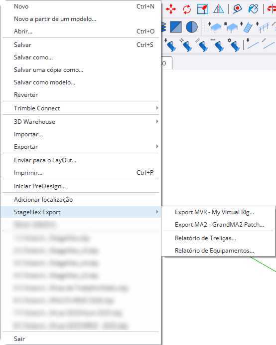
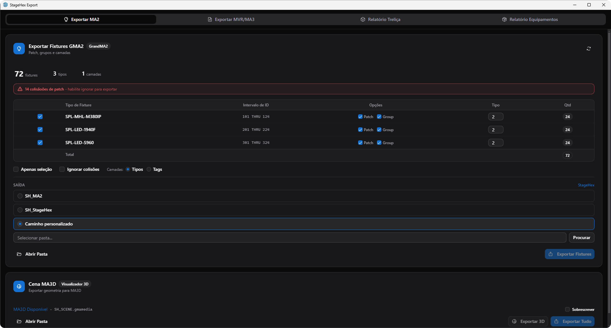
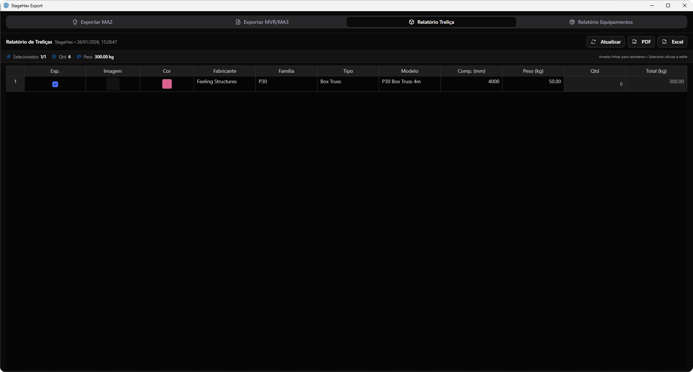
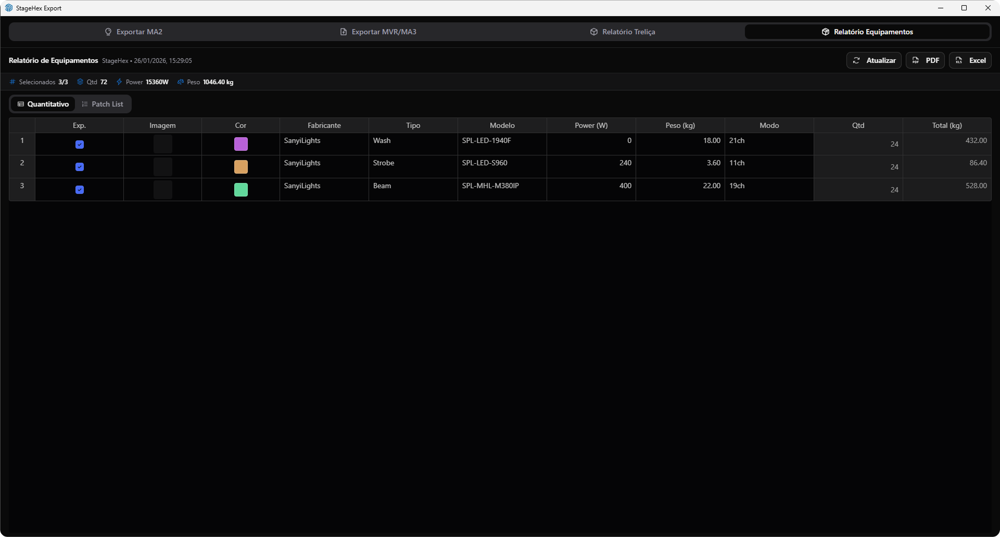

# Exportar e Relatórios

O StageHex possui uma interface dedicada para exportação de projetos e geração de relatórios, acessível através do menu **Arquivo → StageHex Export**.

<figure><figcaption>
Acesso ao StageHex Export pelo menu Arquivo
</figcaption></figure>

***

## Acessando o StageHex Export

No SketchUp, acesse:

**Arquivo → StageHex Export**

Opções disponíveis no menu:

<table>
<thead>
<tr>
<th>Opção</th>
<th>Descrição</th>
</tr>
</thead>
<tbody>
<tr>
<td><strong>Export MVR - My Virtual Rig...</strong></td>
<td>Abre a aba de exportação MVR para grandMA3 e visualizadores</td>
</tr>
<tr>
<td><strong>Export MA2 - GrandMA2 Patch...</strong></td>
<td>Abre a aba de exportação para grandMA2</td>
</tr>
<tr>
<td><strong>Relatório de Treliças...</strong></td>
<td>Abre a aba de relatório de treliças</td>
</tr>
<tr>
<td><strong>Relatório de Equipamentos...</strong></td>
<td>Abre a aba de relatório de equipamentos de iluminação</td>
</tr>
</tbody>
</table>

***

## Interface de Exportação

A janela **StageHex Export** possui quatro abas:

<table>
<thead>
<tr>
<th>Aba</th>
<th>Função</th>
</tr>
</thead>
<tbody>
<tr>
<td><strong>Exportar MA2</strong></td>
<td>Exportação de fixtures para grandMA2 e cena para MA 3D</td>
</tr>
<tr>
<td><strong>Exportar MVR/MA3</strong></td>
<td>Exportação no formato MVR para grandMA3 e visualizadores</td>
</tr>
<tr>
<td><strong>Relatório Treliça</strong></td>
<td>Geração de relatórios de treliças com exportação PDF/Excel</td>
</tr>
<tr>
<td><strong>Relatório Equipamentos</strong></td>
<td>Geração de relatórios de equipamentos com exportação PDF/Excel</td>
</tr>
</tbody>
</table>

***

## Exportar MVR/MA3

Exportação no formato MVR (My Virtual Rig) para softwares de visualização como grandMA3 e Depence.

<figure><figcaption>
Tela de exportação MVR
</figcaption></figure>

### Resumo do Projeto

No topo da interface são exibidos:

* **Fixtures** - Quantidade total de fixtures no projeto
* **Tipos** - Quantidade de tipos diferentes de fixtures
* **Geometrias** - Quantidade de geometrias 3D incluídas

### Tabela de Fixtures

<table>
<thead>
<tr>
<th width="180">Coluna</th>
<th>Descrição</th>
</tr>
</thead>
<tbody>
<tr>
<td><strong>Checkbox</strong></td>
<td>Seleciona o tipo de fixture para exportação</td>
</tr>
<tr>
<td><strong>Tipo de Fixture</strong></td>
<td>Nome do fixture (Fabricante + Modelo)</td>
</tr>
<tr>
<td><strong>Intervalo de ID</strong></td>
<td>Range de Fixture IDs (ex: 101 THRU 124)</td>
</tr>
<tr>
<td><strong>Quantidade</strong></td>
<td>Quantidade de fixtures deste tipo</td>
</tr>
</tbody>
</table>

### Opções de Exportação

<table>
<thead>
<tr>
<th width="180">Opção</th>
<th>Descrição</th>
</tr>
</thead>
<tbody>
<tr>
<td><strong>Apenas seleção</strong></td>
<td>Exporta somente fixtures selecionados no SketchUp</td>
</tr>
<tr>
<td><strong>Incluir geometrias</strong></td>
<td>Adiciona elementos 3D (palco, trusses, cenário) ao MVR</td>
</tr>
</tbody>
</table>

### Destino de Saída

<table>
<thead>
<tr>
<th width="200">Opção</th>
<th>Descrição</th>
</tr>
</thead>
<tbody>
<tr>
<td><strong>SH_StageHex.mvr</strong></td>
<td>Exporta diretamente para a biblioteca do grandMA3 (se instalado)</td>
</tr>
<tr>
<td><strong>SH_MVR.mvr</strong></td>
<td>Sobrescreve arquivo padrão na biblioteca GMA3</td>
</tr>
<tr>
<td><strong>Caminho personalizado</strong></td>
<td>Escolhe arquivo de destino manualmente</td>
</tr>
</tbody>
</table>


O indicador **Biblioteca GMA3 Encontrada** confirma que o grandMA3 está instalado e o arquivo será exportado diretamente para a pasta MVR.


### Formato MVR

O **MVR** (My Virtual Rig) é um formato padrão da indústria que inclui:

* **Fixtures** com posicionamento 3D e patch DMX
* **Arquivos GDTF** embutidos para cada tipo de fixture
* **Geometrias 3D** do palco e cenário (opcional)


O MVR é compatível com Depence, Capture, Vectorworks, grandMA3 e outros softwares de visualização.


***

## Exportar MA2

Exportação para o ecossistema grandMA2/MA3D.

<figure><figcaption>
Tela de exportação grandMA2
</figcaption></figure>

### Resumo do Projeto

No topo da interface são exibidos:

* **Fixtures** - Quantidade total de fixtures
* **Tipos** - Quantidade de tipos diferentes
* **Camadas** - Quantidade de camadas a serem criadas


O aviso **"X colisões de patch"** indica que existem endereços DMX duplicados. Habilite **Ignorar colisões** para exportar mesmo assim, ou corrija os endereços no SketchUp.


### Tabela de Fixtures

<table>
<thead>
<tr>
<th width="150">Coluna</th>
<th>Descrição</th>
</tr>
</thead>
<tbody>
<tr>
<td><strong>Checkbox</strong></td>
<td>Seleciona o tipo de fixture para exportação</td>
</tr>
<tr>
<td><strong>Tipo de Fixture</strong></td>
<td>Nome do fixture (Fabricante + Modelo)</td>
</tr>
<tr>
<td><strong>Intervalo de ID</strong></td>
<td>Range de Fixture IDs (ex: 101 THRU 124)</td>
</tr>
<tr>
<td><strong>Patch</strong></td>
<td>Inclui no macro de patch</td>
</tr>
<tr>
<td><strong>Group</strong></td>
<td>Inclui no macro de grupos</td>
</tr>
<tr>
<td><strong>Tipo</strong></td>
<td>Fixture Type ID para o grandMA2</td>
</tr>
<tr>
<td><strong>Qtd</strong></td>
<td>Quantidade de fixtures deste tipo</td>
</tr>
</tbody>
</table>

### Opções de Exportação

<table>
<thead>
<tr>
<th width="180">Opção</th>
<th>Descrição</th>
</tr>
</thead>
<tbody>
<tr>
<td><strong>Apenas seleção</strong></td>
<td>Exporta somente fixtures selecionados no SketchUp</td>
</tr>
<tr>
<td><strong>Ignorar colisões</strong></td>
<td>Exporta mesmo com endereços DMX duplicados</td>
</tr>
<tr>
<td><strong>Camadas: Tipos</strong></td>
<td>Cria camadas baseadas no tipo de fixture</td>
</tr>
<tr>
<td><strong>Camadas: Tags</strong></td>
<td>Cria camadas baseadas nas Tags do SketchUp</td>
</tr>
</tbody>
</table>

### Destino de Saída - Fixtures

<table>
<thead>
<tr>
<th width="200">Opção</th>
<th>Descrição</th>
</tr>
</thead>
<tbody>
<tr>
<td><strong>SH_MA2</strong></td>
<td>Sobrescreve arquivos padrão na pasta do grandMA2</td>
</tr>
<tr>
<td><strong>SH_StageHex</strong></td>
<td>Usa nome padrão StageHex</td>
</tr>
<tr>
<td><strong>Caminho personalizado</strong></td>
<td>Escolhe pasta de destino manualmente</td>
</tr>
</tbody>
</table>


Se o grandMA2 estiver instalado, o StageHex detecta automaticamente e exporta diretamente para as pastas corretas.


### Cena MA3D

A seção **Cena MA3D** permite exportar a geometria 3D do projeto para o visualizador MA 3D.

<table>
<thead>
<tr>
<th width="180">Opção</th>
<th>Descrição</th>
</tr>
</thead>
<tbody>
<tr>
<td><strong>Sobrescrever</strong></td>
<td>Sobrescreve o arquivo SH_SCENE existente</td>
</tr>
<tr>
<td><strong>Exportar 3D</strong></td>
<td>Exporta apenas a cena 3D</td>
</tr>
<tr>
<td><strong>Exportar Tudo</strong></td>
<td>Exporta fixtures + cena 3D em sequência</td>
</tr>
</tbody>
</table>

O arquivo `SH_SCENE.gmamedia` contém:

* Geometria 3D do palco
* Estruturas de truss
* Elementos de cenário


A exportação de Cena MA3D requer o **MA 3D** instalado no computador.


***

## Relatório de Treliças

Gera relatórios detalhados de todas as treliças do projeto.

<figure><figcaption>
Relatório de Treliças
</figcaption></figure>

### Resumo

No topo são exibidas informações consolidadas:

* **Selecionados** - Quantidade de itens selecionados / total
* **Qtd** - Quantidade total de peças
* **Peso** - Peso total em kg

### Tabela de Treliças

<table>
<thead>
<tr>
<th width="150">Coluna</th>
<th>Descrição</th>
</tr>
</thead>
<tbody>
<tr>
<td><strong>Exp.</strong></td>
<td>Checkbox para incluir na exportação</td>
</tr>
<tr>
<td><strong>Imagem</strong></td>
<td>Preview do componente</td>
</tr>
<tr>
<td><strong>Cor</strong></td>
<td>Cor configurada no Color System</td>
</tr>
<tr>
<td><strong>Fabricante</strong></td>
<td>Fabricante da treliça</td>
</tr>
<tr>
<td><strong>Família</strong></td>
<td>Família/série do produto</td>
</tr>
<tr>
<td><strong>Tipo</strong></td>
<td>Tipo de treliça (Box Truss, Circle, etc.)</td>
</tr>
<tr>
<td><strong>Modelo</strong></td>
<td>Modelo específico</td>
</tr>
<tr>
<td><strong>Comp. (mm)</strong></td>
<td>Comprimento em milímetros</td>
</tr>
<tr>
<td><strong>Peso (kg)</strong></td>
<td>Peso unitário em kg</td>
</tr>
<tr>
<td><strong>Qtd</strong></td>
<td>Quantidade no projeto</td>
</tr>
<tr>
<td><strong>Total (kg)</strong></td>
<td>Peso total (peso unitário x quantidade)</td>
</tr>
</tbody>
</table>

### Exportação

<table>
<thead>
<tr>
<th width="150">Botão</th>
<th>Descrição</th>
</tr>
</thead>
<tbody>
<tr>
<td><strong>Atualizar</strong></td>
<td>Recarrega os dados do projeto</td>
</tr>
<tr>
<td><strong>PDF</strong></td>
<td>Exporta relatório em formato PDF</td>
</tr>
<tr>
<td><strong>Excel</strong></td>
<td>Exporta relatório em formato Excel (.xlsx)</td>
</tr>
</tbody>
</table>


Arraste as linhas para reordenar a lista. Selecione células para editar valores específicos antes de exportar.


***

## Relatório de Equipamentos

Gera relatórios detalhados de todos os equipamentos de iluminação do projeto.

<figure><figcaption>
Relatório de Equipamentos
</figcaption></figure>

### Resumo

No topo são exibidas informações consolidadas:

* **Selecionados** - Quantidade de itens selecionados / total
* **Qtd** - Quantidade total de fixtures
* **Power** - Potência total em Watts
* **Peso** - Peso total em kg

### Modos de Visualização

<table>
<thead>
<tr>
<th width="150">Modo</th>
<th>Descrição</th>
</tr>
</thead>
<tbody>
<tr>
<td><strong>Quantitativo</strong></td>
<td>Agrupa equipamentos por tipo, exibindo totais</td>
</tr>
<tr>
<td><strong>Patch List</strong></td>
<td>Lista todos os fixtures individualmente com endereço DMX</td>
</tr>
</tbody>
</table>

### Tabela de Equipamentos (Quantitativo)

<table>
<thead>
<tr>
<th width="150">Coluna</th>
<th>Descrição</th>
</tr>
</thead>
<tbody>
<tr>
<td><strong>Exp.</strong></td>
<td>Checkbox para incluir na exportação</td>
</tr>
<tr>
<td><strong>Imagem</strong></td>
<td>Preview do equipamento</td>
</tr>
<tr>
<td><strong>Cor</strong></td>
<td>Cor configurada no Color System</td>
</tr>
<tr>
<td><strong>Fabricante</strong></td>
<td>Fabricante do equipamento</td>
</tr>
<tr>
<td><strong>Tipo</strong></td>
<td>Tipo de fixture (Wash, Beam, Strobe, etc.)</td>
</tr>
<tr>
<td><strong>Modelo</strong></td>
<td>Modelo do equipamento</td>
</tr>
<tr>
<td><strong>Power (W)</strong></td>
<td>Potência unitária em Watts</td>
</tr>
<tr>
<td><strong>Peso (kg)</strong></td>
<td>Peso unitário em kg</td>
</tr>
<tr>
<td><strong>Modo</strong></td>
<td>Modo DMX configurado (ex: 21ch, 11ch)</td>
</tr>
<tr>
<td><strong>Qtd</strong></td>
<td>Quantidade no projeto</td>
</tr>
<tr>
<td><strong>Total (kg)</strong></td>
<td>Peso total (peso unitário x quantidade)</td>
</tr>
</tbody>
</table>

### Exportação

<table>
<thead>
<tr>
<th width="150">Botão</th>
<th>Descrição</th>
</tr>
</thead>
<tbody>
<tr>
<td><strong>Atualizar</strong></td>
<td>Recarrega os dados do projeto</td>
</tr>
<tr>
<td><strong>PDF</strong></td>
<td>Exporta relatório em formato PDF</td>
</tr>
<tr>
<td><strong>Excel</strong></td>
<td>Exporta relatório em formato Excel (.xlsx)</td>
</tr>
</tbody>
</table>


Arraste as linhas para reordenar a lista. Selecione células para editar valores específicos antes de exportar.

