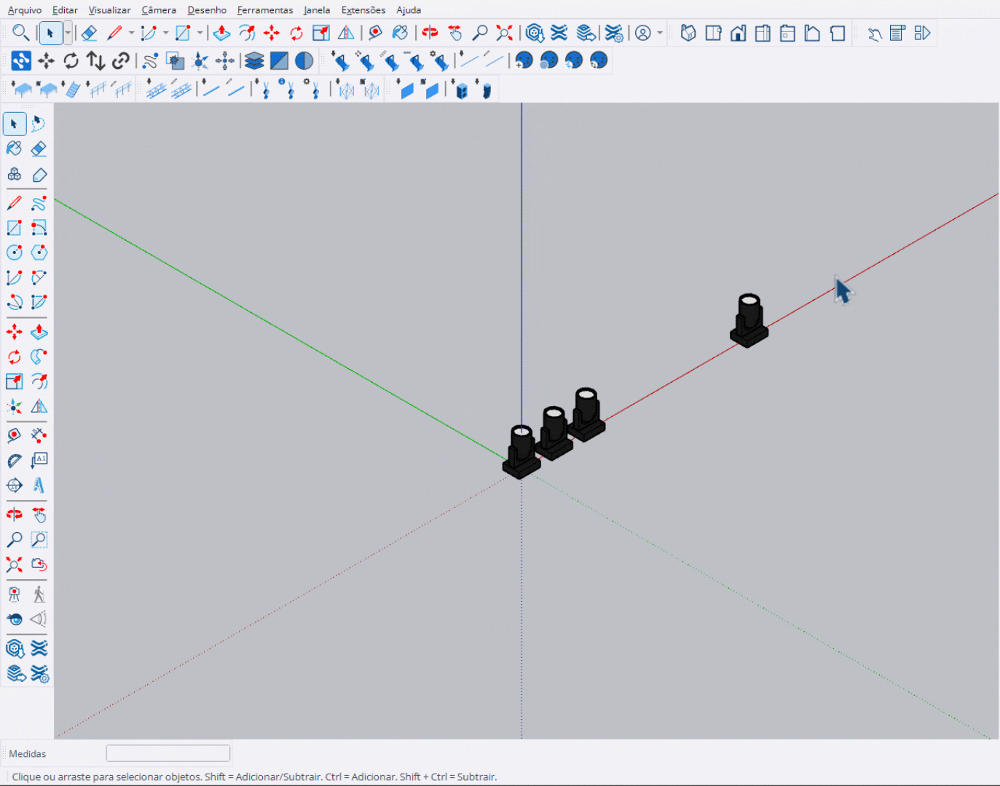

# Alinhar Equipamento

Ferramenta para alinhar e redistribuir fixtures selecionados uniformemente.

<figure><figcaption>
Alinhando fixtures com espaçamento uniforme
</figcaption></figure>

***

## Como Usar

1. **Selecione** 2 ou mais fixtures
2. Ative a ferramenta **Alinhar Equipamento**
3. O preview mostra a distribuição proposta
4. Use **Tab** para alterar o eixo de ordenação
5. Use **Ctrl** para alternar alinhamento de rotação
6. **Enter** para confirmar ou **Esc** para cancelar


Você deve selecionar pelo menos **2 fixtures** antes de ativar a ferramenta.


***

## Controles

<table>
<thead>
<tr>
<th width="180">Tecla</th>
<th>Ação</th>
</tr>
</thead>
<tbody>
<tr>
<td><strong>Ctrl</strong></td>
<td>Alternar alinhamento de rotação (YES/NO)</td>
</tr>
<tr>
<td><strong>Tab</strong></td>
<td>Ciclar eixo de ordenação (Auto → X → Y → Z)</td>
</tr>
<tr>
<td><strong>Enter</strong></td>
<td>Confirmar e aplicar</td>
</tr>
<tr>
<td><strong>Esc</strong></td>
<td>Cancelar operação</td>
</tr>
</tbody>
</table>

***

## Eixos de Ordenação

<table>
<thead>
<tr>
<th width="150">Eixo</th>
<th>Comportamento</th>
</tr>
</thead>
<tbody>
<tr>
<td><strong>Auto</strong></td>
<td>Detecta automaticamente o eixo com maior variação</td>
</tr>
<tr>
<td><strong>X (Red)</strong></td>
<td>Ordena da esquerda para direita</td>
</tr>
<tr>
<td><strong>Y (Green)</strong></td>
<td>Ordena de frente para trás</td>
</tr>
<tr>
<td><strong>Z (Blue)</strong></td>
<td>Ordena de baixo para cima</td>
</tr>
</tbody>
</table>

***

## Alinhamento de Rotação

<table>
<thead>
<tr>
<th width="150">Opção</th>
<th>Comportamento</th>
</tr>
</thead>
<tbody>
<tr>
<td><strong>YES</strong></td>
<td>Todos os fixtures são rotacionados para apontar na direção da linha</td>
</tr>
<tr>
<td><strong>NO</strong></td>
<td>Fixtures mantêm suas rotações originais</td>
</tr>
</tbody>
</table>

***

## Entrada VCB

Você pode digitar comandos no VCB:

<table>
<thead>
<tr>
<th width="150">Comando</th>
<th>Resultado</th>
</tr>
</thead>
<tbody>
<tr>
<td><code>yes</code> / <code>sim</code></td>
<td>Ativa alinhamento de rotação</td>
</tr>
<tr>
<td><code>no</code> / <code>nao</code></td>
<td>Desativa alinhamento de rotação</td>
</tr>
<tr>
<td><code>x</code></td>
<td>Define eixo X para ordenação</td>
</tr>
<tr>
<td><code>y</code></td>
<td>Define eixo Y para ordenação</td>
</tr>
<tr>
<td><code>z</code></td>
<td>Define eixo Z para ordenação</td>
</tr>
<tr>
<td><code>auto</code></td>
<td>Define modo automático</td>
</tr>
</tbody>
</table>

***

## Preview Visual

O preview exibe:

- **Linha amarela**: Conecta primeiro e último fixture
- **Seta dourada**: Indica direção de ordenação
- **Ponto verde**: Primeiro fixture
- **Ponto vermelho**: Último fixture
- **Caixas azuis**: Posições finais dos fixtures
- **Números**: Ordem de cada fixture
- **Painel info**: Distância, espaçamento, eixo atual

***

## Painel de Informações

O painel no canto mostra:

- **Fixtures**: Quantidade selecionada
- **Distance**: Distância total da linha
- **Spacing**: Espaçamento entre fixtures
- **Sort Axis**: Eixo de ordenação atual
- **Align Rotation**: Estado do alinhamento
