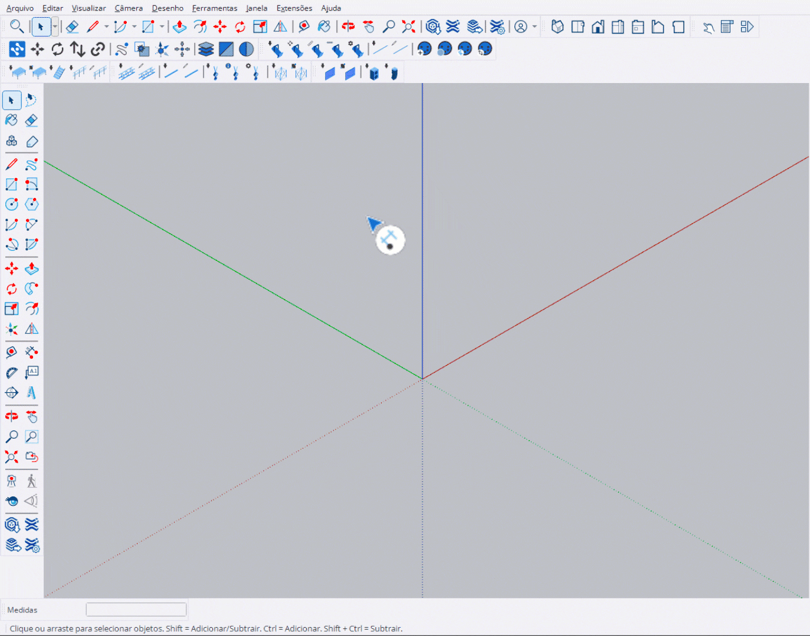

# Distribuir Equipamento

Ferramenta para distribuir fixtures ao longo de uma linha com espaçamento uniforme.

<figure><figcaption>
Distribuindo fixtures em linha
</figcaption></figure>

***

## Como Usar

1. Ative a ferramenta **Distribuir Equipamento**
2. Selecione o modelo de fixture no **HUD**
3. Digite a quantidade desejada (ex: `4x` ou `4`)
4. **1º clique**: Define o ponto inicial (verde)
5. **2º clique**: Define o ponto final (vermelho)
6. Os fixtures são distribuídos uniformemente


O sistema calcula automaticamente o espaçamento entre os fixtures.


***

## Controles

<table>
<thead>
<tr>
<th width="180">Tecla</th>
<th>Ação</th>
</tr>
</thead>
<tbody>
<tr>
<td><strong>Ctrl</strong></td>
<td>Modo Pick - seleciona fixture existente como modelo</td>
</tr>
<tr>
<td><strong>Alt</strong></td>
<td>Alternar rotação alinhada à linha</td>
</tr>
<tr>
<td><strong>Enter</strong></td>
<td>Confirmar posicionamento</td>
</tr>
<tr>
<td><strong>Esc</strong></td>
<td>Cancelar / Voltar ao ponto inicial</td>
</tr>
</tbody>
</table>

***

## Entrada VCB

Você pode definir a quantidade via VCB:

<table>
<thead>
<tr>
<th width="150">Formato</th>
<th>Exemplo</th>
<th>Resultado</th>
</tr>
</thead>
<tbody>
<tr>
<td><code>Nx</code></td>
<td><code>4x</code></td>
<td>Define 4 fixtures</td>
</tr>
<tr>
<td><code>N</code></td>
<td><code>10</code></td>
<td>Define 10 fixtures</td>
</tr>
</tbody>
</table>


A quantidade mínima é **2 fixtures**.


***

## Alinhamento de Rotação

Pressione **Alt** para alternar o modo de rotação:

<table>
<thead>
<tr>
<th width="150">Modo</th>
<th>Comportamento</th>
</tr>
</thead>
<tbody>
<tr>
<td><strong>SIM</strong></td>
<td>Fixtures rotacionados para apontar na direção da linha</td>
</tr>
<tr>
<td><strong>NÃO</strong></td>
<td>Fixtures mantêm orientação original baseada na face</td>
</tr>
</tbody>
</table>

***

## Preview Visual

Durante a distribuição, a ferramenta exibe:

- **Linha amarela**: Conecta os pontos inicial e final
- **Ponto verde**: Posição inicial
- **Ponto vermelho**: Posição final
- **Marcadores roxos**: Posições intermediárias
- **Preview dos fixtures**: Caixas delimitadoras em cada posição
