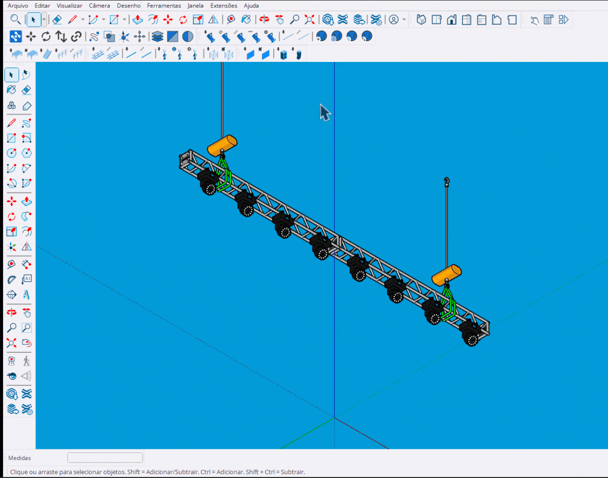

# Patch por Incremento

Ferramenta de patching clique-a-clique com auto-incremento de endereço DMX.

<figure><figcaption>
Patcheando fixtures um a um com auto-incremento
</figcaption></figure>

***

## Como Usar

1. Ative a ferramenta **Patch por Incremento**
2. O HUD mostra os valores atuais (Universe, Address, Unit)
3. Passe o mouse sobre um fixture para ver o preview
4. **Clique** para aplicar o patch
5. Os valores incrementam automaticamente
6. **Enter** para finalizar


O endereço é incrementado automaticamente pelo número de canais do fixture.


***

## Controles

<table>
<thead>
<tr>
<th width="180">Tecla</th>
<th>Ação</th>
</tr>
</thead>
<tbody>
<tr>
<td><strong>Tab</strong></td>
<td>Mostrar/ocultar fixtures já patcheados</td>
</tr>
<tr>
<td><strong>Enter</strong></td>
<td>Finalizar e sair</td>
</tr>
<tr>
<td><strong>Space</strong></td>
<td>Sair da ferramenta</td>
</tr>
<tr>
<td><strong>Esc</strong></td>
<td>Cancelar / Sair</td>
</tr>
<tr>
<td><strong>Ctrl+Z</strong></td>
<td>Desfazer último patch</td>
</tr>
</tbody>
</table>

***

## Preview Visual

Durante o uso, a ferramenta exibe:

<table>
<thead>
<tr>
<th width="150">Cor</th>
<th>Significado</th>
</tr>
</thead>
<tbody>
<tr>
<td><strong>Ciano</strong></td>
<td>Fixture não patcheado (pronto para patch)</td>
</tr>
<tr>
<td><strong>Vermelho</strong></td>
<td>Fixture já patcheado (será sobrescrito)</td>
</tr>
<tr>
<td><strong>Verde</strong></td>
<td>Fixture patcheado nesta sessão</td>
</tr>
<tr>
<td><strong>Branco</strong></td>
<td>Fixtures patcheados anteriormente</td>
</tr>
</tbody>
</table>

***

## Auto-Incremento

Após cada clique:

1. **Address**: Incrementa pelo número de canais do fixture
2. **Unit**: Incrementa em 1
3. **Universe**: Avança automaticamente se ultrapassar 512


Se o endereço ultrapassar 512, o sistema automaticamente avança para o próximo universe.


***

## Desfazer (Undo)

O sistema suporta undo nativo do SketchUp:

- **Ctrl+Z** desfaz o último patch
- Os valores retornam ao estado anterior
- Múltiplos undos são suportados

***

## Sobrescrita

<table>
<thead>
<tr>
<th width="200">Situação</th>
<th>Comportamento</th>
</tr>
</thead>
<tbody>
<tr>
<td><strong>Fixture já patcheado</strong></td>
<td>Caixa vermelha + preview do novo valor</td>
</tr>
<tr>
<td><strong>Fixture da sessão</strong></td>
<td>Beep + ignora clique (evita duplicatas)</td>
</tr>
</tbody>
</table>

***

## HUD

O HUD sincroniza em tempo real:

- **Universe**: Universo atual
- **Address**: Endereço DMX atual
- **Unit**: ID do fixture
- **Channels**: Canais do fixture sob o cursor
- **Session Count**: Fixtures patcheados na sessão
