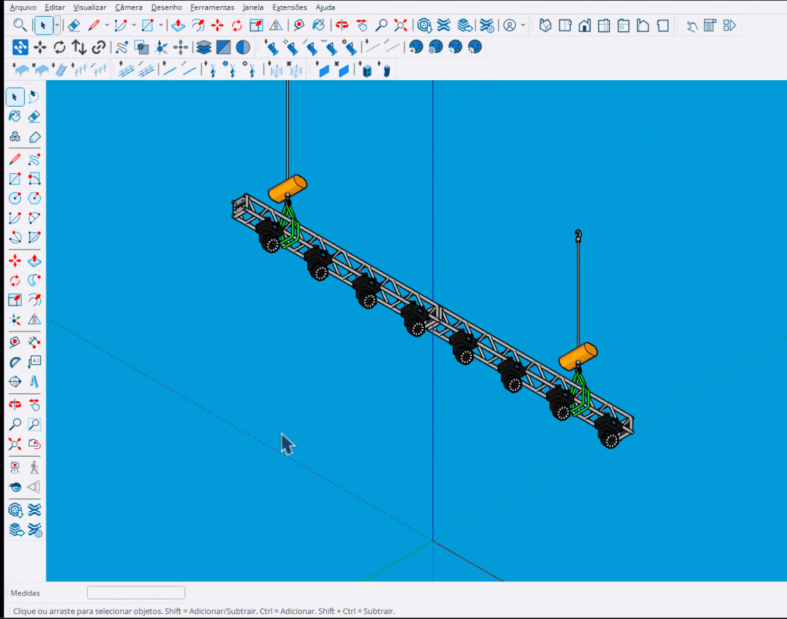

# Patch por Seleção

Ferramenta para patchar múltiplos fixtures selecionados com ordenação 2D.

<figure><figcaption>
Patcheando múltiplos fixtures com ordenação
</figcaption></figure>

***

## Como Usar

1. **Selecione** os fixtures desejados (ou selecione durante o uso)
2. Ative a ferramenta **Patch por Seleção**
3. Configure no HUD: Universe, Address, Unit
4. Defina a ordenação (frente/trás, esquerda/direita)
5. **Enter** para aplicar o patch


Você pode continuar selecionando fixtures enquanto a ferramenta está ativa.


***

## Controles

<table>
<thead>
<tr>
<th width="180">Tecla</th>
<th>Ação</th>
</tr>
</thead>
<tbody>
<tr>
<td><strong>Tab</strong></td>
<td>Mostrar/ocultar fixtures já patcheados</td>
</tr>
<tr>
<td><strong>Enter</strong></td>
<td>Aplicar patch</td>
</tr>
<tr>
<td><strong>Space</strong></td>
<td>Sair da ferramenta</td>
</tr>
<tr>
<td><strong>Esc</strong></td>
<td>Cancelar / Sair</td>
</tr>
</tbody>
</table>

***

## Ordenação 2D

A ordenação usa um sistema de grid 2D:

### Primeira Ordem

<table>
<thead>
<tr>
<th width="200">Opção</th>
<th>Descrição</th>
</tr>
</thead>
<tbody>
<tr>
<td><strong>Front to Back</strong></td>
<td>Da frente para trás (eixo Y)</td>
</tr>
<tr>
<td><strong>Back to Front</strong></td>
<td>De trás para frente</td>
</tr>
<tr>
<td><strong>Left to Right</strong></td>
<td>Da esquerda para direita (eixo X)</td>
</tr>
<tr>
<td><strong>Right to Left</strong></td>
<td>Da direita para esquerda</td>
</tr>
<tr>
<td><strong>Top to Bottom</strong></td>
<td>De cima para baixo (eixo Z)</td>
</tr>
<tr>
<td><strong>Bottom to Top</strong></td>
<td>De baixo para cima</td>
</tr>
</tbody>
</table>

### Segunda Ordem

Aplica ordenação secundária dentro de cada "fila" da primeira ordem.

***

## Preview Visual

Durante o uso:

- **Caixas coloridas**: Indicam ordem dos fixtures
- **Labels**: Universe.Address e Unit ID
- **Cor ciano**: Fixtures selecionados
- **Cor vermelha**: Fixtures que serão sobrescritos

***

## Seleção Dinâmica

A ferramenta monitora a seleção em tempo real:

- **Adicionar**: Selecione mais fixtures com Shift+Click
- **Remover**: Desselecione com Ctrl+Click
- **Recalculo**: A ordenação é recalculada automaticamente

***

## Overflow de Universe

Se o patch ultrapassar o endereço 512:

- O sistema avança automaticamente para o próximo universe
- O endereço é ajustado para caber no novo universe


Verifique o preview antes de aplicar para garantir que os universes estão corretos.


***

## Tipos Mistos

Quando diferentes tipos de fixtures são selecionados:

- Cada tipo pode ter número diferente de canais
- O espaçamento é calculado individualmente
- O preview mostra os valores corretos para cada fixture
