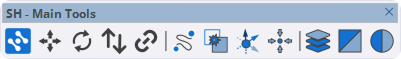

# Main Tools

Ferramentas essenciais para interface, manipulação de objetos, organização e visualização no SketchUp.

<figure><figcaption>
SH - Main Tools
</figcaption></figure>

***

## Lista de Ferramentas

<table>
<thead>
<tr>
<th width="50" align="center">#</th>
<th>Ferramenta</th>
<th>Descrição</th>
</tr>
</thead>
<tbody>
<tr>
<td align="center">1</td>
<td><strong>Gerenciador de Interface</strong></td>
<td>Abre o painel principal de gerenciamento da StageHex</td>
</tr>
<tr>
<td align="center">2</td>
<td><strong>Mover Objetos</strong></td>
<td>Ferramenta para mover objetos com precisão</td>
</tr>
<tr>
<td align="center">3</td>
<td><strong>Rotacionar Objetos</strong></td>
<td>Ferramenta para rotacionar objetos</td>
</tr>
<tr>
<td align="center">4</td>
<td><strong>Substituir Componentes</strong></td>
<td>Substitui componentes selecionados (CTRL = todas as instâncias)</td>
</tr>
<tr>
<td align="center">5</td>
<td><strong>Selecionar Similares</strong></td>
<td>Seleciona componentes similares ao selecionado (CTRL = adicionar/remover)</td>
</tr>
<tr>
<td align="center">6</td>
<td><strong>Distribuir Objetos</strong></td>
<td>Distribui objetos ao longo de um caminho</td>
</tr>
<tr>
<td align="center">7</td>
<td><strong>Explodir Grupos</strong></td>
<td>Explode grupos e componentes (protege componentes StageHex)</td>
</tr>
<tr>
<td align="center">8</td>
<td><strong>Definir Eixo de Trabalho</strong></td>
<td>Define um eixo de trabalho personalizado</td>
</tr>
<tr>
<td align="center">9</td>
<td><strong>Mover para Origem</strong></td>
<td>Move objetos selecionados para a origem</td>
</tr>
<tr>
<td align="center">10</td>
<td><strong>Gerenciador de Etiquetas</strong></td>
<td>Gerencia tags/camadas dos objetos</td>
</tr>
<tr>
<td align="center">11</td>
<td><strong>Controle de Visualização</strong></td>
<td>Alterna entre modo simplificado e detalhado</td>
</tr>
<tr>
<td align="center">12</td>
<td><strong>Controle de Cores</strong></td>
<td>Alterna entre cores por material e cores por preset</td>
</tr>
</tbody>
</table>

***

## Detalhes das Ferramentas

### Gerenciador de Interface

Abre o painel principal de gerenciamento da StageHex, onde você pode:

* Gerenciar biblioteca de componentes
* Configurar cores do sistema
* Gerenciar camadas
* Exportar para MVR e MA2

### Mover Objetos

Ferramenta de movimentação com precisão para objetos StageHex.

### Rotacionar Objetos

Ferramenta de rotação para objetos com controle de ângulo.

### Substituir Componentes

Substitui componentes selecionados por outro componente:

* **Clique normal** - Substitui apenas os selecionados
* **CTRL + Clique** - Substitui todas as instâncias do componente

### Selecionar Similares

Seleciona automaticamente todos os componentes similares ao atualmente selecionado:

* **Clique normal** - Seleciona similares
* **CTRL + Clique** - Adiciona ou remove da seleção

### Distribuir Objetos

Distribui objetos uniformemente ao longo de um caminho ou linha selecionada.

### Explodir Grupos

Explode grupos e componentes em seus elementos individuais.


Componentes StageHex são protegidos e não serão explodidos para preservar os metadados técnicos.


### Definir Eixo de Trabalho

Permite definir um eixo de trabalho personalizado para operações de transformação.

### Mover para Origem

Move os objetos selecionados para a origem do modelo (0, 0, 0).

### Gerenciador de Etiquetas

Abre o gerenciador de tags/camadas para organização dos objetos.

### Controle de Visualização

Alterna a visualização dos componentes StageHex:

* **Modo Simplificado** - Geometria simplificada para melhor performance
* **Modo Detalhado** - Geometria completa com todos os detalhes

### Controle de Cores

Alterna o modo de coloração dos componentes:

* **Por Material** - Exibe as cores originais dos materiais
* **Por Preset** - Aplica cores configuradas no sistema de cores
