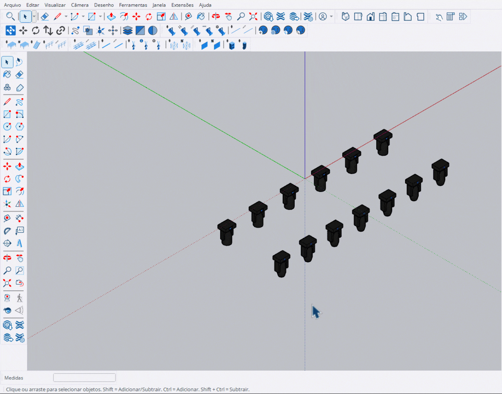

# Explodir Grupos

Ferramenta para explodir grupos e componentes em seus elementos individuais.

<figure><figcaption>
Explosão de grupos e componentes
</figcaption></figure>

***

## Como Usar

1. Selecione os grupos ou componentes que deseja explodir
2. Ative a ferramenta **Explodir Grupos**
3. Os elementos selecionados serão explodidos automaticamente

***

## Proteção de Componentes


**Componentes StageHex** e **grupos bloqueados** são protegidos e **não serão explodidos**.

Isso preserva os metadados técnicos e configurações dos componentes do sistema.


***

## Comportamento

<table>
<thead>
<tr>
<th width="200">Tipo de Elemento</th>
<th width="150" align="center">Pode Explodir?</th>
<th>Observação</th>
</tr>
</thead>
<tbody>
<tr>
<td>Grupos comuns</td>
<td align="center">✔</td>
<td>Explode normalmente</td>
</tr>
<tr>
<td>Componentes comuns</td>
<td align="center">✔</td>
<td>Explode normalmente</td>
</tr>
<tr>
<td>Componentes StageHex</td>
<td align="center">✖</td>
<td>Protegido - preserva metadados</td>
</tr>
<tr>
<td>Grupos bloqueados</td>
<td align="center">✖</td>
<td>Protegido - desbloqueie primeiro</td>
</tr>
</tbody>
</table>

***

## Controles

<table>
<thead>
<tr>
<th width="180">Tecla</th>
<th>Ação</th>
</tr>
</thead>
<tbody>
<tr>
<td><strong>Esc</strong></td>
<td>Sair da ferramenta</td>
</tr>
</tbody>
</table>
