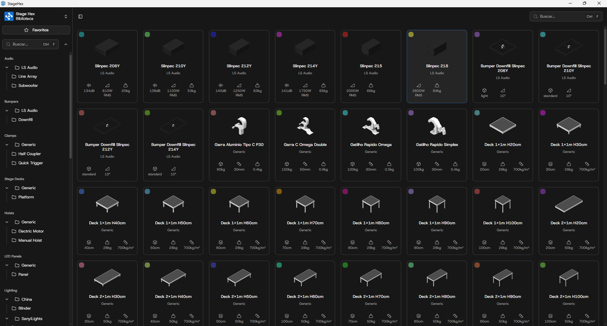
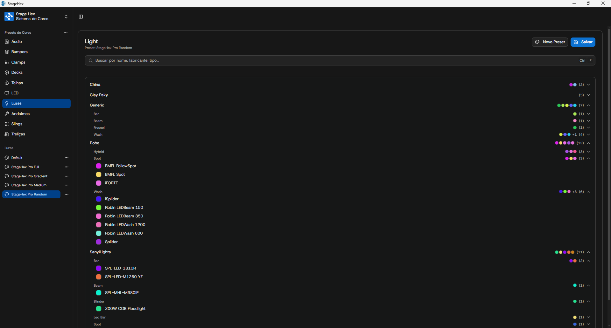
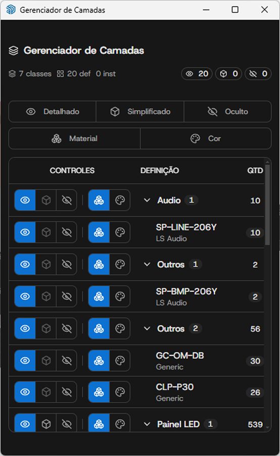

# Gerenciador de Interface

O Gerenciador de Interface é o painel principal da StageHex, acessível através do primeiro botão da barra Main Tools. Oferece acesso centralizado a todas as funcionalidades de gerenciamento do plugin.

***

## Abas do Gerenciador

<table>
<thead>
<tr>
<th>Aba</th>
<th>Função</th>
</tr>
</thead>
<tbody>
<tr>
<td><strong>Biblioteca</strong></td>
<td>Biblioteca de componentes organizados por categoria</td>
</tr>
<tr>
<td><strong>Color System</strong></td>
<td>Configuração de cores padrão dos componentes</td>
</tr>
<tr>
<td><strong>Camadas</strong></td>
<td>Gerenciamento de visibilidade e organização</td>
</tr>
</tbody>
</table>


Para exportação de projetos e relatórios, acesse **Arquivo → StageHex Export**. Veja mais em [Exportar e Relatórios](../../exportacao.md).


***

## Biblioteca

Biblioteca de componentes organizada por categorias, permitindo inserir diretamente no SketchUp.

<figure><figcaption>
Biblioteca de Componentes
</figcaption></figure>

### Funcionalidades

**Navegação por Pastas**
* Clique nas categorias no menu lateral para filtrar
* Subcategorias expandem ao clicar

**Pesquisa**
* Campo de busca no topo da interface
* Atalho `Ctrl + F` para focar na pesquisa
* Pesquisa por nome do componente
* Resultados em tempo real

**Inserção de Componentes**
1. Navegue até a categoria desejada
2. Clique no componente para selecioná-lo
3. Clique no modelo para posicionar


Os componentes são sincronizados automaticamente da StageHex Cloud conforme seu plano de assinatura.


***

## Color System

Sistema de configuração de cores padrão para identificação visual dos componentes no modelo.

<figure><figcaption>
Sistema de Cores
</figcaption></figure>

### Funcionalidades

**Configuração de Cores**
* Selecione a categoria no menu lateral (Truss, Deck, LED, etc.)
* Visualize os componentes e suas cores atuais
* Clique na cor para alterar

**Presets de Cores**
* Crie presets personalizados
* Salve configurações de cores para reutilização
* Aplique presets com um clique

**Exportar/Importar Presets**
* Exporte presets como arquivo `.json`
* Compartilhe configurações com outros usuários
* Importe presets de terceiros

### Modos de Visualização

Na barra Main Tools, o botão **Controle de Cores** alterna entre:

* **Por Material** - Exibe os materiais originais dos componentes
* **Por Cor** - Aplica as cores configuradas no Color System


Use cores distintas para diferentes tipos de truss ou fabricantes para facilitar a identificação visual no modelo.


***

## Camadas

Aba de controle de visibilidade, modo de visualização e cores dos componentes StageHex. Esta mesma interface também está disponível em acesso rápido pelo botão **10** da Toolbar Main Tools.

<figure><figcaption>
Aba Camadas no Gerenciador de Interface
</figcaption></figure>

Veja a documentação completa em [Gerenciador de Camadas](gerenciador-de-camadas.md).
