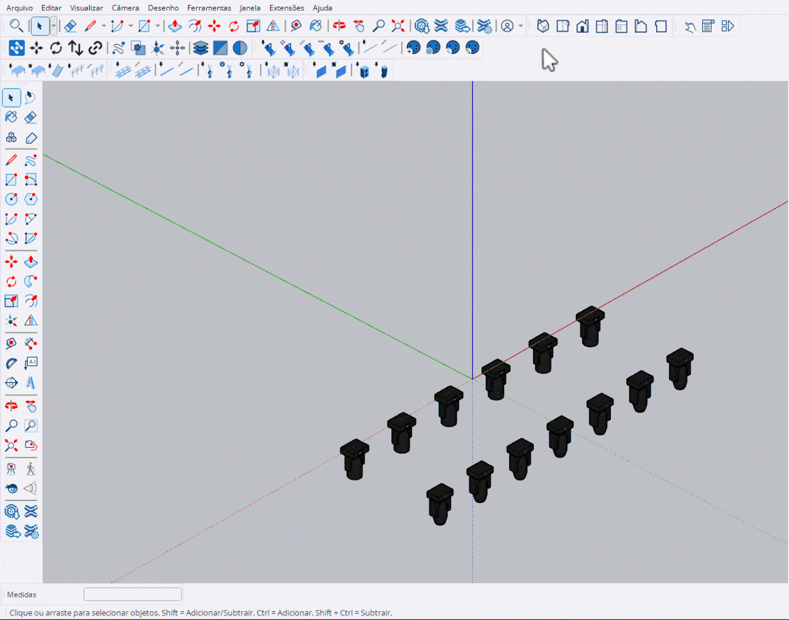

# Mover para Origem

Ferramenta para mover toda a seleção para o centro do projeto.

<figure><figcaption>
Movendo seleção para a origem do modelo
</figcaption></figure>

***

## Como Usar

1. Selecione os objetos que deseja centralizar
2. Ative a ferramenta **Mover para Origem**
3. Os objetos serão movidos para a origem (0, 0)

***

## Comportamento


O eixo **Z é mantido fixo**. Os objetos são movidos apenas nos eixos X e Y, preservando a altura original.


<table>
<thead>
<tr>
<th width="150">Eixo</th>
<th width="150" align="center">Alterado?</th>
<th>Descrição</th>
</tr>
</thead>
<tbody>
<tr>
<td><strong>X</strong></td>
<td align="center">✔</td>
<td>Move para X = 0</td>
</tr>
<tr>
<td><strong>Y</strong></td>
<td align="center">✔</td>
<td>Move para Y = 0</td>
</tr>
<tr>
<td><strong>Z</strong></td>
<td align="center">✖</td>
<td>Mantém altura original</td>
</tr>
</tbody>
</table>

***

## Controles

<table>
<thead>
<tr>
<th width="180">Tecla</th>
<th>Ação</th>
</tr>
</thead>
<tbody>
<tr>
<td><strong>Click</strong></td>
<td>Aplicar movimento para origem</td>
</tr>
<tr>
<td><strong>Esc</strong></td>
<td>Sair da ferramenta</td>
</tr>
</tbody>
</table>

***

## Uso Comum

Esta ferramenta é útil para:

- Centralizar estruturas de palco no projeto
- Alinhar equipamentos com a origem do modelo
- Preparar modelo para exportação com posicionamento correto
- Organizar elementos antes de criar relatórios ou plantas
