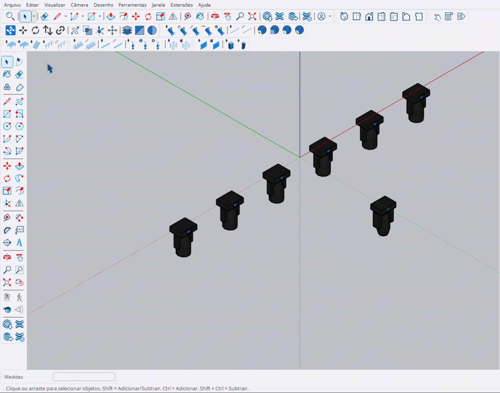
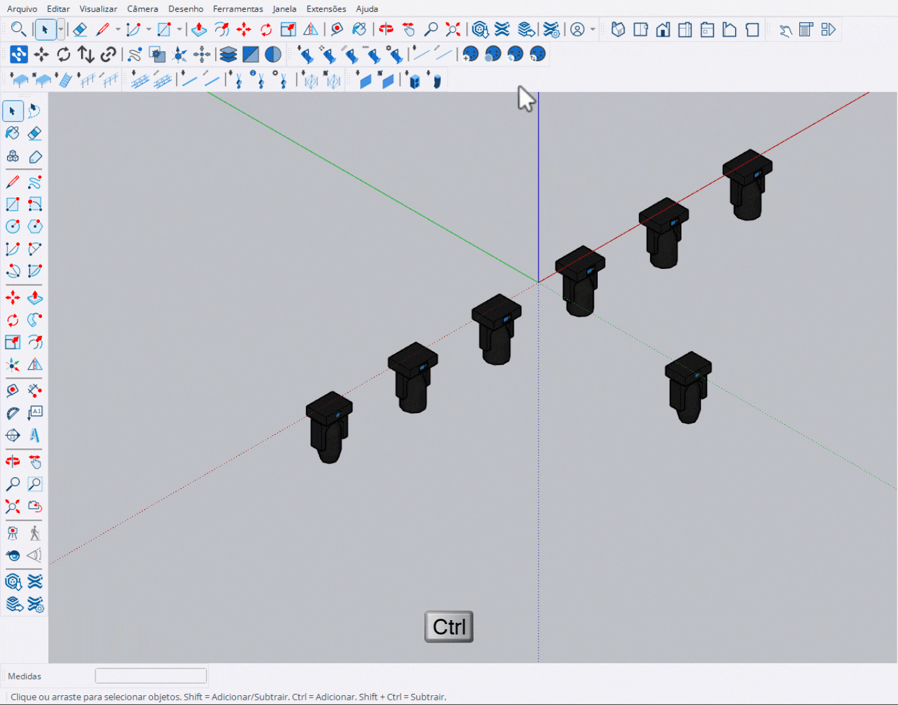

# Substituir Componentes

Ferramenta para substituir componentes por outros, com múltiplos modos de operação.

***

## Modo 1: Origem → Destino

Substitui um componente específico por outro.

<figure><figcaption>
Substituição: Origem → Destino
</figcaption></figure>

**Como usar:**
1. Ative a ferramenta na barra Main Tools
2. Clique no componente de **origem** (que será usado como modelo)
3. Clique no componente de **destino** (que será substituído)

***

## Modo 2: Com Ctrl (Múltiplas Instâncias)

Substitui todas as instâncias de um componente de uma vez.

<figure><figcaption>
Substituição com Ctrl: Todas as instâncias
</figcaption></figure>

**Como usar:**
1. Ative a ferramenta na barra Main Tools
2. Segure **Ctrl** e clique para selecionar todas as instâncias do componente destino
3. Clique no componente de origem

***

## Modo 3: Pré-seleção

Selecione os destinos antes de ativar a ferramenta.

<figure><figcaption>
Substituição com pré-seleção
</figcaption></figure>

**Como usar:**
1. Selecione os componentes de **destino** (que serão substituídos)
2. Ative a ferramenta na barra Main Tools
3. Clique no componente de **origem** (que será usado como modelo)

***

## Controles

<table>
<thead>
<tr>
<th>Tecla</th>
<th>Função</th>
</tr>
</thead>
<tbody>
<tr>
<td><strong>Ctrl</strong></td>
<td>Seleciona todas as instâncias do componente / Sai da ferramenta</td>
</tr>
<tr>
<td><strong>Esc</strong></td>
<td>Sai da ferramenta</td>
</tr>
</tbody>
</table>


A substituição preserva a posição, rotação e escala do componente original.

