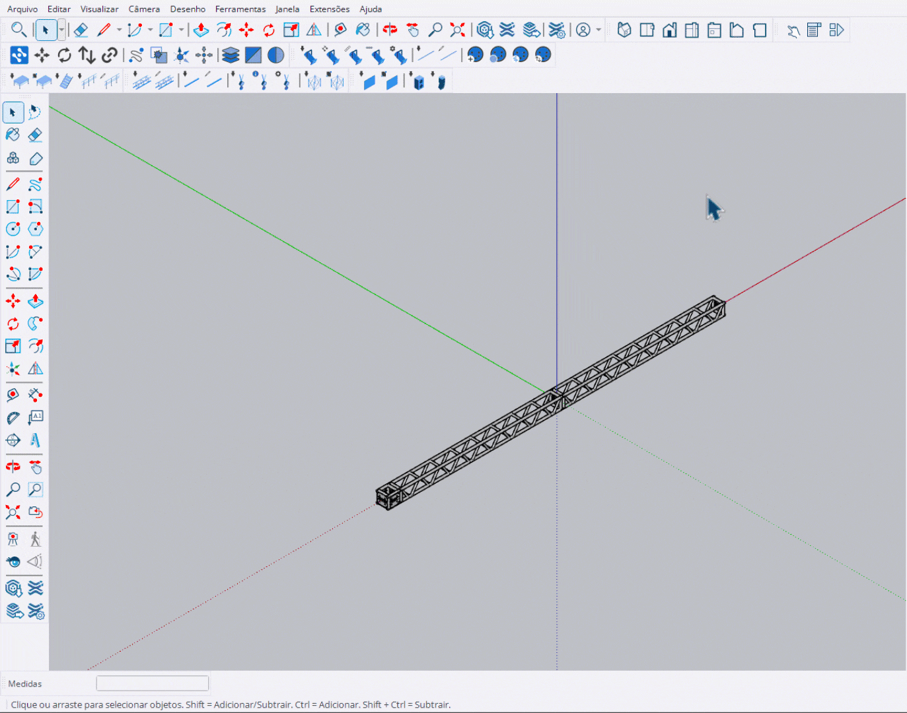

# Rigging Tools

Ferramentas para criação de estruturas de rigging: trusses, talhas e cintas.

<figure><figcaption>
SH - Rigging Tools
</figcaption></figure>

***

## Lista de Ferramentas

<table>
<thead>
<tr>
<th width="50" align="center">#</th>
<th>Ferramenta</th>
<th>Descrição</th>
</tr>
</thead>
<tbody>
<tr>
<td align="center">1</td>
<td><a href="inserir-truss.md"><strong>Inserir Truss</strong></a></td>
<td>Posiciona trusses individualmente com snap automático</td>
</tr>
<tr>
<td align="center">2</td>
<td><a href="desenhar-truss.md"><strong>Desenhar Truss</strong></a></td>
<td>Distribui trusses ao longo de um caminho</td>
</tr>
<tr>
<td align="center">3</td>
<td><a href="inserir-talha.md"><strong>Inserir Talha</strong></a></td>
<td>Posiciona talhas (hoists) entre truss/cinta e destino</td>
</tr>
<tr>
<td align="center">4</td>
<td><a href="ajustar-altura.md"><strong>Ajustar Altura</strong></a></td>
<td>Ajusta a altura (trim) de talhas selecionadas</td>
</tr>
<tr>
<td align="center">5</td>
<td><a href="inserir-cinta.md"><strong>Inserir Cinta</strong></a></td>
<td>Posiciona cintas (slings) no truss</td>
</tr>
</tbody>
</table>

***

## Sistema de Snap

As ferramentas de truss utilizam um sistema de **snap automático** que detecta pontos de conexão:

- **Verde**: Snap disponível para conexão
- **Vermelho**: Snap ativo (sob o cursor)
- **Amarelo**: Linha de orientação


O snap permite conectar trusses automaticamente, mantendo alinhamento e espaçamento corretos.


***

## HUD de Seleção

As ferramentas de Rigging utilizam um **HUD** (Head-Up Display) para seleção de modelos:

- Exibe catálogo de modelos disponíveis
- Permite trocar modelo durante o uso da ferramenta
- Mostra preview do modelo selecionado

***

## Função Pick (Ctrl)

As ferramentas **Inserir Truss** e **Desenhar Truss** possuem a função **Pick**:

<figure><figcaption>
Usando Ctrl para selecionar truss como referência
</figcaption></figure>

- Pressione **Ctrl** para entrar no modo Pick
- Clique em um truss existente para usá-lo como referência
- A ferramenta passa a usar o mesmo modelo do truss selecionado
