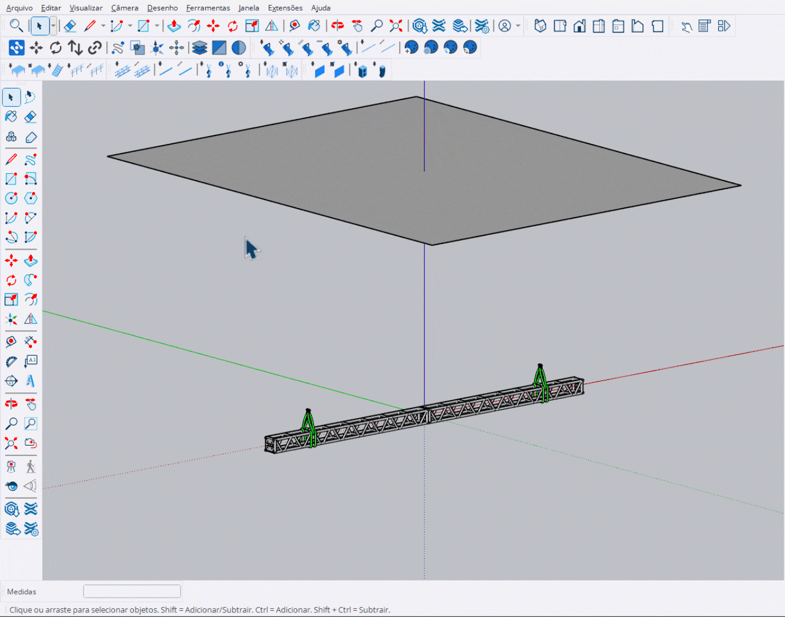

# Inserir Talha (Hoist)

Ferramenta para posicionar talhas (hoists) entre truss/cinta e um destino.

<figure><figcaption>
Posicionando talha entre cinta e teto
</figcaption></figure>

***

## Como Usar

1. Ative a ferramenta **Inserir Talha**
2. Selecione o modelo no **HUD**
3. **1º clique**: Selecione a **cinta** ou **truss** (ponto inferior)
4. **2º clique**: Selecione o **destino** (teto/truss superior)
5. A talha é criada conectando os dois pontos


A posição X/Y é travada após o primeiro clique, centralizada no eixo do truss.


***

## Controles

<table>
<thead>
<tr>
<th width="180">Tecla</th>
<th>Ação</th>
</tr>
</thead>
<tbody>
<tr>
<td><strong>Enter</strong></td>
<td>Finalizar e sair</td>
</tr>
<tr>
<td><strong>Esc</strong></td>
<td>Cancelar / Sair</td>
</tr>
</tbody>
</table>

***

## Entrada VCB

Você pode definir a altura exata via VCB:

<table>
<thead>
<tr>
<th width="150">Formato</th>
<th>Exemplo</th>
<th>Resultado</th>
</tr>
</thead>
<tbody>
<tr>
<td><code>Xcm</code></td>
<td><code>400cm</code></td>
<td>Altura de 400cm para cima</td>
</tr>
<tr>
<td><code>Xm</code></td>
<td><code>4m</code></td>
<td>Altura de 4 metros para cima</td>
</tr>
<tr>
<td><code>-Xm</code></td>
<td><code>-1.5m</code></td>
<td>Altura de 1.5m para baixo</td>
</tr>
</tbody>
</table>

***

## Direção Automática

A ferramenta detecta automaticamente a direção:

- **Para cima**: Se o 2º clique estiver acima do 1º
- **Para baixo**: Se o 2º clique estiver abaixo do 1º

***

## Pontos de Conexão

<table>
<thead>
<tr>
<th width="150">1º Clique</th>
<th>Opções</th>
</tr>
</thead>
<tbody>
<tr>
<td><strong>Cinta</strong></td>
<td>Conecta no ponto SHACKLE da cinta</td>
</tr>
<tr>
<td><strong>Truss</strong></td>
<td>Conecta no centro do eixo do truss</td>
</tr>
</tbody>
</table>

<table>
<thead>
<tr>
<th width="150">2º Clique</th>
<th>Opções</th>
</tr>
</thead>
<tbody>
<tr>
<td><strong>Truss</strong></td>
<td>Usa altura Z do truss</td>
</tr>
<tr>
<td><strong>Livre</strong></td>
<td>Usa altura Z do cursor</td>
</tr>
</tbody>
</table>
