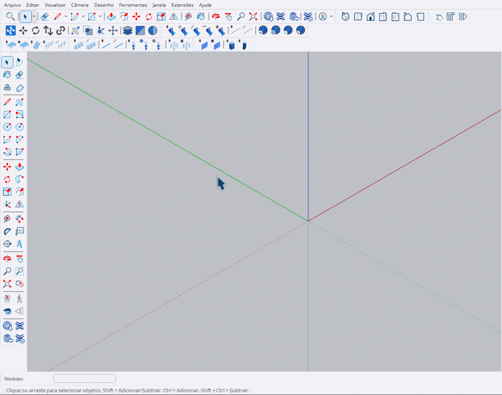

# Inserir Truss

Ferramenta para posicionar trusses individualmente com sistema de snap automático.

<figure><figcaption>
Posicionando trusses com snap automático
</figcaption></figure>

***

## Como Usar

### Posicionamento com Snap

1. Ative a ferramenta **Inserir Truss**
2. Selecione o modelo no **HUD**
3. Aproxime o cursor de um truss existente
4. O sistema detecta os **pontos de snap** (verde/vermelho)
5. **Clique** no snap para conectar automaticamente

### Posicionamento Livre

1. **1º clique**: Define o ponto inicial
2. **2º clique**: Define a orientação/direção
3. O truss é criado na posição indicada


A ferramenta permanece ativa após cada colocação, permitindo **posicionamento contínuo**.


***

## Controles

<table>
<thead>
<tr>
<th width="180">Tecla</th>
<th>Ação</th>
</tr>
</thead>
<tbody>
<tr>
<td><strong>Ctrl</strong></td>
<td>Modo Pick - seleciona truss como referência</td>
</tr>
<tr>
<td><strong>Alt</strong></td>
<td>Alternar opções de rotação</td>
</tr>
<tr>
<td><strong>Enter</strong></td>
<td>Finalizar e sair</td>
</tr>
<tr>
<td><strong>Esc</strong></td>
<td>Cancelar / Sair</td>
</tr>
</tbody>
</table>

***

## Sistema de Snap

<table>
<thead>
<tr>
<th width="120">Cor</th>
<th>Significado</th>
</tr>
</thead>
<tbody>
<tr>
<td><strong>Verde</strong></td>
<td>Ponto de snap disponível</td>
</tr>
<tr>
<td><strong>Vermelho</strong></td>
<td>Snap ativo (sob o cursor)</td>
</tr>
<tr>
<td><strong>Amarelo</strong></td>
<td>Linha de orientação</td>
</tr>
<tr>
<td><strong>Azul</strong></td>
<td>Bounding box do truss</td>
</tr>
</tbody>
</table>

***

## Função Pick

Pressione **Ctrl** para ativar o modo Pick:

<figure><figcaption>
Selecionando truss como referência
</figcaption></figure>

1. Segure **Ctrl** para entrar no modo Pick
2. Clique em um truss existente
3. A ferramenta passa a usar o mesmo modelo
