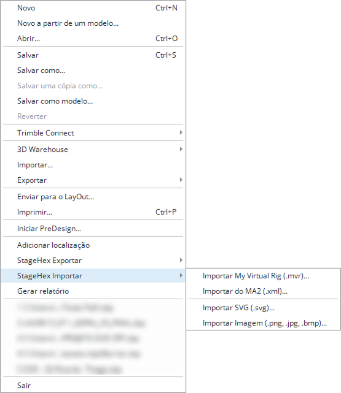

# Importar

O StageHex possui um menu dedicado para importação de arquivos técnicos e geometrias, acessível diretamente pelo SketchUp.

<figure><figcaption>
Acesso ao StageHex Importar pelo menu Arquivo
</figcaption></figure>

***

## Acessando o StageHex Importar

No SketchUp, acesse:

**Arquivo → StageHex Importar**

Opções disponíveis no menu:

<table>
<thead>
<tr>
<th>Opção</th>
<th>Descrição</th>
</tr>
</thead>
<tbody>
<tr>
<td><strong>Importar My Virtual Rig (.mvr)...</strong></td>
<td>Importa fixtures, universos e patch a partir de arquivos MVR</td>
</tr>
<tr>
<td><strong>Importar do MA2 (.xml)...</strong></td>
<td>Importa patch, fixtures e universos a partir de projetos grandMA2</td>
</tr>
<tr>
<td><strong>Importar SVG (.svg)...</strong></td>
<td>Importa geometria vetorial para uso no projeto</td>
</tr>
<tr>
<td><strong>Importar Imagem (.png, .jpg, .bmp)...</strong></td>
<td>Gera geometria a partir de imagem, com remoção automática de background</td>
</tr>
</tbody>
</table>

***

## Formatos de Importação

<table>
<thead>
<tr>
<th>Formato</th>
<th width="150">Extensão</th>
<th>Conteúdo importado</th>
</tr>
</thead>
<tbody>
<tr>
<td><strong>MVR (My Virtual Rig)</strong></td>
<td>*.mvr</td>
<td>Fixtures, universos e patch</td>
</tr>
<tr>
<td><strong>grandMA2 XML</strong></td>
<td>*.xml</td>
<td>Patch, fixtures e universos</td>
</tr>
<tr>
<td><strong>SVG</strong></td>
<td>*.svg</td>
<td>Geometria vetorial</td>
</tr>
<tr>
<td><strong>Imagem</strong></td>
<td>*.png / *.jpg / *.jpeg / *.bmp</td>
<td>Geometria gerada a partir da imagem</td>
</tr>
</tbody>
</table>


A importação MVR traz dados técnicos como fixtures, universos e patch. Ela não importa o rig completo como geometria editável.


