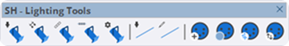
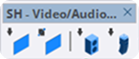

# Toolbar

O StageHex organiza suas ferramentas em 5 barras de ferramentas especializadas, cada uma focada em uma área específica da produção de eventos.

***

## Barras de Ferramentas

<table>
<thead>
<tr>
<th>Barra</th>
<th>Descrição</th>
<th width="100" align="center">Ferramentas</th>
</tr>
</thead>
<tbody>
<tr>
<td><strong>Main Tools</strong></td>
<td>Ferramentas essenciais de interface, manipulação e organização</td>
<td align="center">12</td>
</tr>
<tr>
<td><strong>Event Tools</strong></td>
<td>Plataformas, escadas e guarda-corpos para eventos</td>
<td align="center">5</td>
</tr>
<tr>
<td><strong>Rigging Tools</strong></td>
<td>Treliças, tubos, talhas, cintas e andaimes</td>
<td align="center">9</td>
</tr>
<tr>
<td><strong>Lighting Tools</strong></td>
<td>Equipamentos de iluminação, distribuição e patch DMX</td>
<td align="center">11</td>
</tr>
<tr>
<td><strong>Video/Audio Tools</strong></td>
<td>Painéis LED e sistemas de áudio</td>
<td align="center">4</td>
</tr>
</tbody>
</table>

***

## Visualização das Barras

### Main Tools

<figure><figcaption>
SH - Main Tools
</figcaption></figure>

### Event Tools

<figure><figcaption>
SH - Event Tools
</figcaption></figure>

### Rigging Tools

<figure><figcaption>
SH - Rigging Tools
</figcaption></figure>

### Lighting Tools

<figure><figcaption>
SH - Lighting Tools
</figcaption></figure>

### Video/Audio Tools

<figure><figcaption>
SH - Video/Audio Tools
</figcaption></figure>

***

## Gerenciamento das Barras

As barras de ferramentas podem ser gerenciadas através do menu **Extensões → StageHex**:

* **Mostrar Todas as Barras** - Exibe todas as barras
* **Ocultar Todas as Barras** - Oculta todas as barras
* **Resetar Posições das Barras** - Restaura posições padrão


As posições das barras são salvas automaticamente e restauradas ao reabrir o SketchUp.


***

## Disponibilidade por Plano

<table>
<thead>
<tr>
<th>Barra</th>
<th width="150" align="center">Trial</th>
<th width="150" align="center">Basic</th>
<th width="150" align="center">Pro</th>
</tr>
</thead>
<tbody>
<tr>
<td><strong>Main Tools</strong></td>
<td align="center">✔ Completas</td>
<td align="center">✔ Essenciais</td>
<td align="center">✔ Completas</td>
</tr>
<tr>
<td><strong>Event Tools</strong></td>
<td align="center">✔</td>
<td align="center">✔</td>
<td align="center">✔</td>
</tr>
<tr>
<td><strong>Rigging Tools</strong></td>
<td align="center">✔</td>
<td align="center">✖</td>
<td align="center">✔</td>
</tr>
<tr>
<td><strong>Lighting Tools</strong></td>
<td align="center">✔ Completas</td>
<td align="center">✔ Básicas</td>
<td align="center">✔ Completas</td>
</tr>
<tr>
<td><strong>Video/Audio Tools</strong></td>
<td align="center">✔</td>
<td align="center">✔</td>
<td align="center">✔</td>
</tr>
</tbody>
</table>


Ferramentas não disponíveis no seu plano aparecerão desabilitadas (cinza) na barra de ferramentas.

